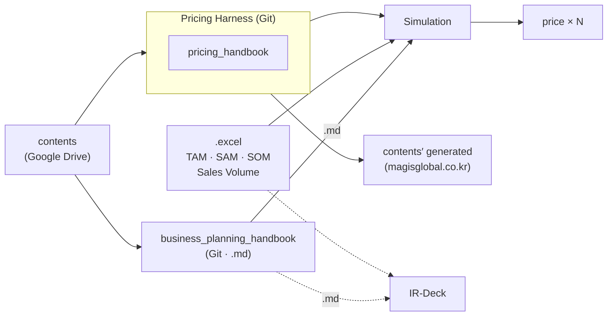

# Pricing Strategy Handbook v0.1 (English)

> [🇰🇷 한국어로 읽기](../ko/README.md) · [⬅ Back to main](../README.md)

## Purpose of This Handbook

A practical handbook that treats pricing not as a single number decision but as a structure connecting business model, customer value, competition, channel, cost, revenue model, and business feasibility. It combines a Knowledge Source (pricing-strategy theory) and a Tool Source (the Pricing Harness execution engine) into one canonical handbook.

## Target Audience

Founders, consultants, and business planners who want to learn pricing strategy systematically. No specific industry experience is assumed.

## Where This Handbook Sits

In this project, **Harness means the Pricing Harness only.** The handbooks are `.md` knowledge sources that feed it; they are not harnesses themselves.

## 3-Part Structure

### Part I — Pricing Strategy

- [CH01. Price Is the Outcome of the Business Model](chapters/CH01.md)
- [CH02. Cost and Cost Structure](chapters/CH02.md)
- [CH03. Two Logics of Pricing — Customer Value and Competition](chapters/CH03.md)
- [CH04. How Channel and Customer Relationship Reshape Price Structure](chapters/CH04.md)
- [CH05. Revenue Streams and Pricing Mechanisms](chapters/CH05.md)
- [CH06. The Three Financial Lenses and the Bridge to Business Feasibility](chapters/CH06.md)

### Part II — Feasibility Bridge

- [CH07. The Effective Market and My Market](chapters/CH07.md)
- [CH08. From Qualitative to Quantitative — Effective Market Sizing and P×Qty](chapters/CH08.md)
- [CH09. Interpreting QCD and Projected P&L, and Iterative Validation](chapters/CH09.md)

### Part III — Pricing Harness

- [CH10. MODE A — Current Price Diagnosis](chapters/CH10.md)
- [CH11. MODE B — Target Price Reverse Calculation](chapters/CH11.md)
- [CH12. MODE C — Allowable Cost Reverse Calculation](chapters/CH12.md)
- [CH13. BEP — Break-Even Point](chapters/CH13.md)
- [CH14. Scenario Compare](chapters/CH14.md)
- [CH15. Validating Price Hypotheses and Making Decisions](chapters/CH15.md)

## Worksheets / Examples

Every chapter includes one practical [worksheet](manual/) (15 total). [Examples](examples/) are included only where the source material (a Knowledge Module or a Pricing Harness CASE document) actually contains one (13 total) — no example was invented. Each example can also be used as an exercise: first work through the "Exercise" (or "Think it through") yourself, then check it with "Show answer and walkthrough". The questions were built only from the example's own figures and wording.

## Source Policy

This handbook combines two source types.
- **Knowledge Source**: the author's internal Knowledge Base (pricing-strategy theory)
- **Tool Source**: the Pricing Harness (a pricing-calculation and scenario-comparison engine)

No external research, web search, or general-knowledge supplementation was used. See [`../source-map.md`](../source-map.md) for the chapter-to-source mapping.

## Known Limitations (stated honestly)

A few chapters (CH03, CH05, CH15) include areas the source material or tool does not yet cover — rather than filling these gaps with unsupported content, the chapter states plainly "not yet defined / not yet implemented." See each chapter and [`../source-map.md`](../source-map.md) for details.

## Version

**v0.1** — Korean Private Release Candidate, human-reviewed and approved; this English edition is its direct, unabridged translation. Not yet published.
