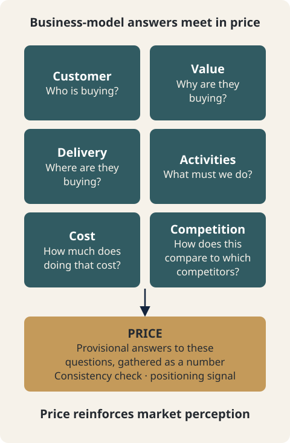

# CH01. Price Is the Outcome of the Business Model

> **Presentation key message:** Price is not a number added at the end; it is the outcome of a business model aligning customer, value, delivery, and cost.

## 1. Learning Objectives

By the end of this chapter, you will be able to:

- Understand Price not as "the number attached at the end, once the product is finished," but as the outcome of the business model.
- Explain that Price comprehensively reflects multiple elements — customer, problem, value, delivery method, and cost.
- Apply the view that Price is the standard by which you check the consistency among the various elements of the business model, to your own business.
- See why the pricing components covered in later chapters (customer, value, competition, cost) follow in this particular order.

## 2. Core Concepts

If you think of Price as the number attached at the end, once the product is finished, you miss an important link in business planning. Price is closer to an outcome that comprehensively reflects who the customer is, what problem that customer has, what value is being provided, how that value is delivered, and how much cost is involved in that process.

Viewed through the three categories of the business model — value creation, value delivery, and the Revenue Model — Price does not stop at being a revenue source. You also need to look at which customer segment will pay that price, whether that price is worth that much value, whether the channel can sustain that price, and whether the cost of maintaining the customer relationship can be covered. Price becomes the standard of consistency that confirms whether the various elements of the business model are connected without contradiction.

## 3. Why It Matters

Key resources and key activities create the cost structure; channels and customer relationships change the value the customer perceives and the cost of selling; partnerships affect resource access, negotiating power, and competitive position. Without considering all of these elements together, it is difficult to set a "living price" that the market will accept.

From this perspective, Price is not an independent variable. As the value provided to the customer grows, the possibility of justifying a higher price arises, but realizing that value may also require more expensive resources and activities. Choosing direct sales can reduce distribution margin, but you must then bear customer acquisition and operations yourself. Choosing an indirect channel can increase market access, but fees and distribution margin then enter into the price structure. Using a partner can supplement resources you lack, but you must also examine the economic compensation paid to the partner and the negotiating power involved.

Seen this way, before answering the question "how much should we charge," a few premises need to already be settled. This is the question of who is paying. Business planning already addresses this premise in a separate discussion elsewhere. Defining the customer is at the same time defining the boundary of the market, and depending on who is chosen as the customer, the name and structure of the market change even for the same product. In addition, the User who experiences the problem, the Buyer who decides the purchase, and the Payer who pays the cost can converge into a single person in B2C, but are often separated in B2B and B2G, and the logic that drives the purchase itself differs by transaction type (B2C, B2B, B2G). Likewise, the Value Proposition is not a sentence summarizing the product's strengths, but a state in which a specific customer's problem, the solution provided, and the reason for choosing it over existing alternatives are connected into a single logic — and even the same technology or product can have a different Value Proposition depending on the customer and purchase structure. These three premises (customer, buyer role, Value Proposition) have already been covered elsewhere in this Handbook, so this chapter only briefly confirms their conclusions before moving on.

## 4. Framework / Logic

The logic that determines Price can be seen not as a single calculation but as a structure in which several questions overlap. Within the question "What is an appropriate Price?" lie the overlapping questions "Who is buying?", "Why are they buying?", "Where are they buying?", "What must we do?", "How much does doing that cost?", and "How does this compare to which competitors?" Price is closer to the outcome of these tentative answers converging into a number.

This logic applies just as much when referencing competitors. Competition-based pricing is not a matter of copying the industry average price; it is a method of first defining a solution that provides similar customer value to the same customer segment, and then comparing against it. Therefore, before looking at competitor prices, you must first settle the customer, the value, and the scope of substitutes. At the same time, Price is also a positioning signal that leads customers to interpret the position of quality and brand. A low price may look advantageous for market entry, but once perceived as a low-price brand, moving to the premium market afterward can require significant cost and time. Conversely, a high-price strategy is not established simply by raising the price; it requires the product and service, customer experience, channel, and brand that together justify the higher price. Price is both the outcome of positioning and, at the same time, a means of reinforcing that positioning.

## 5. Application Process

1. **Confirm the premises.** First check whether the customer has been defined, whether the User/Buyer/Payer roles have been distinguished, whether the purchase logic according to transaction type (B2C, B2B, B2G) has been reflected, and whether the Value Proposition has been organized into a single logic.
2. **Reposition Price as an outcome.** Revisit Price not as the number attached after the product is finished, but as the outcome that synthesizes customer, problem, value, delivery method, and cost.
3. **Confirm the connection with business model elements.** Examine, one by one, how key resources/key activities (cost structure), channels/customer relationships (perceived value and cost of selling), and partnerships (resources, negotiating power, competitive position) interlock with Price.
4. **Reflect competition and positioning.** First define the competitors being compared as "solutions that provide similar value to the same customer segment," and then examine what positioning signal the price sends.
5. **Check consistency.** Confirm that the Price organized this way connects without contradiction to the other elements of the business model.

## 6. Applying This in Pricing or the Harness

This chapter has no separate calculation tool or Harness. This is because Part Ⅰ is a Knowledge-only chapter that organizes the perspective for viewing Price. Instead, the perspective established in this chapter becomes the premise for the work of calculating and validating actual prices in later chapters. The elements covered in the chapters that follow — customer value, positioning relative to competitors, cost structure — are all translated into concrete numbers on top of the principle confirmed in this chapter: that Price is the standard for confirming the consistency of the various elements of the business model. Accordingly, the conclusion of this chapter carries forward as the input premise for each calculation and checking procedure used in later chapters.

## 7. Practical Checkpoints

- Before setting Price, have the customer, buyer role, transaction type, and Value Proposition already been organized?
- Are you asking about Price not only as "how much should we charge," but also asking whether that price is consistent with the other elements of the business model (resources, activities, channels, customer relationships, partnerships)?
- When referencing competitor prices, have you first defined "a solution that provides similar value to the same customer" rather than simply following the industry average?
- Have you examined what positioning signal the current price will be interpreted as in the market?

## 8. Key Takeaways

- Price is not the number attached at the end, once the product is finished, but an outcome that comprehensively reflects customer, problem, value, delivery method, and cost.
- Price does not stop at being a revenue source; it is the standard of consistency confirming whether the various elements of the business model are connected without contradiction.
- Key resources/key activities, channels/customer relationships, and partnerships each connect to Price through cost structure, perceived value and cost of selling, and negotiating power/competitive position, respectively.
- Within the question "What is an appropriate Price?" lie several overlapping questions: who is buying, why they are buying, where they are buying, what we must do, how much it costs, and how it compares to competitors.
- Competition-based pricing is not about copying competitors' prices; it is the work of first defining a solution that provides similar value to the same customer, and then comparing against it.
- Price is both the outcome of positioning and, at the same time, a means of reinforcing that positioning.

## 9. Practical Questions

- Is the price I am about to set "the number attached after the product is fully built," or is it an outcome that synthesizes customer, problem, value, delivery method, and cost?
- Does this price connect without contradiction to our business model's key resources, key activities, channels, customer relationships, and partnerships?
- Is the "competitor" we are comparing against actually a solution that provides similar value to the same customer segment?
- What quality/brand position is this price likely to be interpreted as by customers?
- Are the premises of customer, buyer role, transaction type, and Value Proposition already sufficiently organized, or do they need to be reconfirmed before discussing Price?

## Source Map

- MN: MN06 (primary), MN03/MN04 (prerequisite, cited briefly)
- KM: KM043 (primary), KM018/KM019/KM020/KM031/KM047 (prerequisite)
