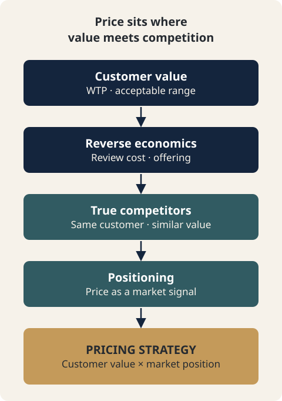

# CH03. Two Logics of Pricing — Customer Value and Competition

> **Presentation key message:** A sound price reflects both the value customers recognize and the position the business chooses among alternatives.

## 1. Learning Objectives

By the end of this chapter, you will be able to distinguish Value-Based Pricing from Competition-Based Pricing as two distinct logics, and explain that price is not simply a number but a positioning signal that shapes how customers read quality and brand standing.

## 2. Core Concepts

There are at least two distinct logics for setting a price.

The first is Value-Based Pricing. Calculating cost does not automatically determine price. Customers do not pay to compensate a company for the costs it incurred internally. Customers pay because they feel the product or service solves a problem that matters to them or delivers the value they want. If cost sets the practical floor of a price, the range customers are willing to pay sets the other boundary. Unlike cost-plus pricing, which starts from cost and adds a margin, Value-Based Pricing first identifies the price range and willingness to pay that customers will accept, then works backward to review cost structure and product composition so that the business case holds at that price. This requires customer research and market-response testing.

The second is Competition-Based Pricing. It refers to competitor prices, but it is not simply a matter of copying the industry average. The first step is deciding who to compare against. Being in the same product category does not automatically make a company a real competitor. A competitor is defined as a solution that delivers similar customer value to the same customer segment. So before comparing competitor prices, you must first define the customer, the value, and the scope of substitutes.

These two logics are not mutually exclusive. Value-Based Pricing asks, "Is there a basis for customers to accept this price?" while Competition-Based Pricing asks, "What position does this price signal in the market?" Both questions need to be addressed together in the pricing process.

## 3. Why It Matters

Price connects to the Positioning that forms in the customer's mind. Even for products with the same functionality, the price a customer will accept depends on what problem they perceive it as solving, what differentiated value they feel relative to substitutes, and what experience they have during the purchase process. Value-based pricing is the process of confirming what value customers actually recognize, and checking that this value is delivered consistently across product, channel, and promotion.

The source material describes value-added pricing as not simply following a competitor's price cut, but instead justifying a higher price by adding differentiated value. The point is not the discount itself, but designing, at the same time, the value the customer actually feels and the profit structure the company must protect.

From a competitive standpoint, price is also a signal that leads customers to interpret quality and brand standing. A low price may look advantageous for market entry, but once a brand is perceived as low-price, moving to a premium market later can require significant cost and time. In particular, if a startup without sufficient resources or infrastructure enters low-price competition before achieving economies of scale, it has to grow while accepting a low operating margin, and in the process, financial and operational risk can grow. Conversely, a premium strategy does not work simply by raising the price. It requires the product, service, customer experience, channel, and brand together to justify the higher price.

## 4. Framework / Logic

The two logics can be organized into a single flow as follows.

- Value-Based Pricing: the value the customer segment assigns to the product → identifying the price range and willingness to pay that customers will accept → working backward to review cost and product composition so the business case holds at that price
- Competition-Based Pricing: defining the real competitors (solutions that deliver similar value to the same customer segment) → comparing those competitors' prices → deciding what Positioning (quality and brand standing) the price should convey

If you want to set a higher price, the justification cannot be "because our cost is higher" — you need to design and demonstrate a basis of value that customers can accept. Price is both the result of Positioning and a means of reinforcing that Positioning. So when discussing pricing strategy, the question should not only be "how much should we charge?" but also "what value do we want to be remembered for, by which customers?"

One thing must be stated honestly. These two logics explain the direction and rationale in which price can move, but **a standard procedure for calibrating the price floor and ceiling into actual numbers is not established even in this Knowledge Source.** The conceptual boundaries — cost as the floor, customer willingness to pay as the ceiling — are presented, but the source material does not contain a procedure for converting these into specific numbers (for example, some multiple of cost, or some percentile point from a willingness-to-pay study). Accordingly, this handbook does not invent a numeric calibration procedure.

## 5. Application Process

1. Define the target customer segment and confirm what problem it expects the product to solve, or what value it expects from the product.
2. Through customer research and market-response testing, identify the price range and willingness to pay that customers will accept.
3. Work backward from that price range to review whether cost and product composition make the business case viable.
4. Define the real competitors (including substitutes) that deliver similar value to the same customer segment.
5. Compare those competitors' prices, without simply copying the industry average.
6. Review what Positioning signal (low-price / mid-price / premium) this price will convey to customers, and check whether the product, service, channel, and brand support that signal.
7. If an exact number is required for the price floor or ceiling, note that this Knowledge Source currently has no standard procedure for that, and record that separate verification or further source material is needed.

## 6. Applying This in Pricing or the Harness

The Pricing Harness currently has no capability that directly calculates value-based or competition-based pricing. According to the tool's documentation, Value Pricing and Competitive Pricing are not yet implemented. The two logics in this chapter are therefore not concepts that the Harness's formulas rest on; in Part III they serve as lenses for interpreting the results of MODE A and MODE B.

MODE A calculates how much is actually left at the current price (the cost-side boundary), and MODE B calculates the price needed to reach a target contribution margin rate. Neither mode, however, calculates whether customers will accept that price (the value boundary) or what that price signals against competitors (the competition and Positioning signal). That judgment remains a human one, made with the two axes organized in this chapter, and CH10 and CH11 return to this connection. This chapter does not cover the specific calculation methods for either mode.

## 7. Practical Checkpoints

- Are you setting price only by adding a margin to cost?
- Have you confirmed the value customers actually recognize through research or testing, or are you only estimating it?
- Is what you call a "competitor" actually a solution that delivers similar value to the same customer segment?
- Does your current price match your intended Positioning (low-price, premium, etc.)?
- If you have chosen a low-price strategy, do you have the readiness and financial capacity to accept a low operating margin without economies of scale?
- If you have chosen a premium strategy, do you actually have the product, service, customer experience, channel, and brand in place to justify that price?
- If you are being asked to state the price floor or ceiling as a number, are you first aware that no standard procedure exists for that?

## 8. Key Takeaways

Price is not the result of adding a margin to cost — it is the joint result of two logics: the value customers recognize, and the Positioning it creates in the market. Value-Based Pricing first confirms customers' willingness to pay and then works backward to design the business case; Competition-Based Pricing first defines the real competitors and then treats price as a Positioning signal. A standard procedure for calibrating the exact numeric price floor and ceiling has not yet been established, so this handbook does not make an arbitrary determination on that point.

## 9. Practical Questions

- In our product/service, why do customers actually pay money?
- Do the companies we call our "competitors" really deliver the same value to the same customers?
- Does our current price match the brand position we want, or was it set out of habit?

## Source Map
- MN: MN06
- KM: KM046, KM047
