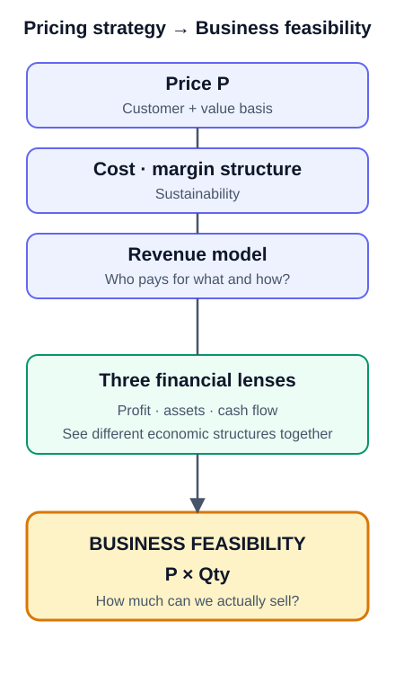

# CH06. The Three Financial Lenses and the Bridge to Business Feasibility

> **Presentation key message:** Business feasibility can be tested through profit, assets, and cash flow only after price P, the cost-and-margin structure, and the revenue model are defined.

## 1. Learning Objectives

By distinguishing three financial perspectives — P&L, Asset Value, and Cash Flow — you can read a single business from multiple angles, and judge whether, once price, cost, and revenue model have been settled, you are ready to move on to the next step: Business Feasibility validation.

## 2. Core Concepts

When looking at a revenue model, it is easy to think only of the margin line on the income statement. But drawing on the three core financial statements (income statement, balance sheet, cash flow statement), the same business can be seen through three different lenses: the P&L view, the Asset view, and the Cash Flow view.

This distinction is not an attempt to transplant traditional accounting categories directly onto business model types. It is a practical thinking tool for viewing the same question — "where is economic value actually being created?" — from different angles.

Once price and revenue model design have reached this point, the next question shifts to: "How much can actually be sold at that price, and is the business sustainable?" This is the starting point of Business Feasibility validation, and there are key inputs that must be settled before handing off to that starting point.

## 3. Why It Matters

The three lenses do not substitute for one another. Viewing a single business simultaneously through the P&L, Asset, and Cash Flow perspectives reveals different economic structures within that same business. If you treat product-sale margin as the entirety of the revenue model, the business can become vulnerable to intensifying competition or shifts in the product life cycle. In the early business-planning stage, rather than asking only "what is the revenue?", asking together "what is accumulating?" and "when does cash come in and go out?" gives a more three-dimensional view of the revenue model.

Also, the work of designing price, cost, and revenue model has an endpoint. If you move on vaguely to the next step (market sizing, Business Feasibility validation) without a standard for judging that this work is complete, you end up calculating the serviceable market on a weak foundation. The purpose of this chapter is to establish the standard for what must be settled before moving on.

## 4. Framework / Logic

**The Three Financial Lenses**

- **P&L View**: The most familiar perspective. It looks at the structure in which a product or service generates revenue through sales, and profit remains after costs are deducted. Price, sales volume, cost of goods, SG&A, and margin are the key variables.
- **Asset Value View**: This looks at how the value of assets held rises through business activity. Ordinary operating profit alone may not look attractive, but once you factor in a structure where the business builds asset value and is eventually sold, the economic meaning changes. Rather than judging based on current-period P&L alone, you must also look at what assets accumulate over the course of the business.
- **Cash Flow View**: This asks a different question from P&L. Even when revenue is recognized, if actual cash arrives late or costs must be paid out first, funding pressure can arise. Conversely, in a structure where customer payments are held for a period before being settled to the seller, the time funds remain in the system — and the flow itself — becomes an important part of the business structure.

**Three Inputs for Moving from Price to Business Feasibility**

To judge that price and revenue model design is complete, you must be able to explain what cost structure the price assumes, what value customers recognize, and how competition, channel, and customer relationships change that price and margin. The key inputs for handing this off to the next step come down to three:

1. Price P grounded in the customer and the value they recognize
2. The cost and margin structure that makes the business sustainable at that price
3. The revenue model explaining what customers pay for and how

If these three have not been settled, it is still premature to move on to market sizing.

Revenue and the size of the serviceable market can be explained as the product of price and sales quantity. However, to avoid confusing the Q (Quality) in QCD with the Q (Quantity) in sales volume, this handbook denotes sales quantity as Qty. In the next stage (Part II), P×Qty is used as the starting point to address projected P&L, QCD, serviceable market, and market sizing by B2C, B2B, and B2G in full.

## 5. Application Process

1. Organize the business under review from the P&L view: can you explain the structure of price, sales volume, cost of goods, SG&A, and margin?
2. Look at the same business again from the Asset view: are there assets accumulating through this business, and is there economic meaning beyond current-period P&L that can be explained through eventual sale or value appreciation?
3. Look at the same business again from the Cash Flow view: is there a gap between when revenue is recognized and when cash actually comes in, and is there a structure where funds are held for a period (e.g., pending settlement)?
4. Bring together what the three lenses reveal to identify where this business's economic value is actually being created.
5. Check whether price P, cost/margin structure, and revenue model (what customers pay for and how) are each in an explainable state.
6. If all three are settled, judge that you are ready to move to the next step (Part II, MN07). If even one remains unsettled, do not move on to Business Feasibility validation (market sizing) — address that item first.

## 6. Applying This in Pricing or the Harness

Cross-checking the outputs of pricing strategy work (price P, cost/margin structure, revenue model) against the three financial lenses helps ensure you do not miss asset-accumulating or cash-flow-driven structures that don't show up on the P&L. In particular, if a revenue model is designed only from the P&L view, there is a risk of under- or overestimating the business's economic attractiveness relative to competing models that hold funds in the system or accumulate asset value. Use this chapter's checklist as the final gate before handing pricing strategy outputs off to the next step (Part II: Business Feasibility).

## 7. Practical Checkpoints

- Can you explain this business's price, sales volume, cost of goods, SG&A, and margin structure from the P&L view?
- Are there assets accumulating through this business? Are you judging the business's attractiveness based only on current-period profit?
- Is there a gap between when revenue is recognized and when cash actually comes in? Is there a structure where funds are held for a period?
- Can you explain what cost structure the price assumes?
- Can you explain what value customers recognize that makes them accept this price?
- Can you explain how competition, channel, and customer relationships change this price and margin?
- Can you explain what customers pay for and how (the revenue model)?
- Are all of the items above explainable, or is it still too early to move on to market sizing?

## 8. Key Takeaways

The three financial lenses — P&L, Asset Value, and Cash Flow — do not substitute for one another; viewed together, they reveal different economic structures within the same business. Price and revenue model design can be considered complete once you can explain the cost structure the price assumes, the value customers recognize, and how competition and channel affect price and margin. The key inputs handed off to the next step are three: price P, cost/margin structure, and revenue model. Only once these three are settled can you move on to Business Feasibility validation (Part II), which asks "how much can actually be sold at that price, and is the business sustainable?"

This chapter concludes Part I (Pricing Strategy). Part II takes P×Qty as its starting point and covers projected P&L, QCD, serviceable market size, and market sizing by B2C, B2B, and B2G, corresponding to the MN07 domain.

## 9. Practical Questions

- If you described the business you are currently working on in one sentence each from the P&L, Asset, and Cash Flow perspectives, how would they differ?
- Among price P, cost/margin structure, and revenue model, which is still insufficiently explained?
- What risk would there be in moving on to market sizing without first addressing that insufficiently explained item?

## Source Map

- MN: MN06
- KM: KM053, KM054
