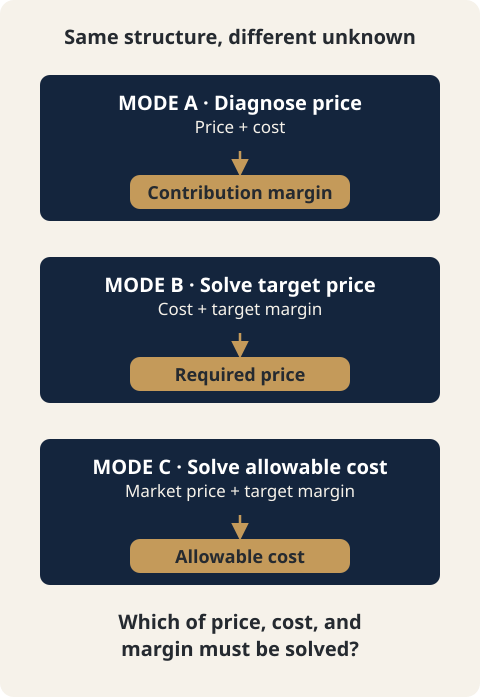

# CH12. MODE C — Allowable Cost Reverse Calculation

> **Presentation key message:** When the market price is fixed, reverse-calculate the maximum allowable cost and check its gap from actual cost (`direct_cost_gap`).

## 1. Learning Objectives

Be able to calculate the maximum allowable direct cost (Allowable Direct Cost) needed to hold a target economic outcome (Contribution Margin Rate) when the market price is fixed.

## 2. Core Concepts

MODE C answers a single question.

> "Given the market price and a target Contribution Margin Rate, what is the maximum allowable product/service direct cost?"

This is a **target costing** calculation. It is the opposite of a cost-plus approach, where you build the product first and then check afterward whether "it can be sold at this price." Instead, MODE C starts from the price the market will accept and the margin the business requires, and works backward to the cost ceiling that product design must respect.

MODE C does not calculate a price. The selling price is given exogenously — by the market, competitor pricing, or the client's existing price positioning — and MODE C never recomputes or proposes it. It calculates only one thing: "given that price and that margin target, how much room is left in the cost."

## 3. Why It Matters

In consulting engagements, clients rarely set a price from a blank slate. More often the market has already signaled the price — competitor pricing, existing price positioning, or a resistance threshold customers won't accept. MODE A diagnoses how much a given price currently earns, and MODE B calculates the price required to hold an existing cost structure and profitability target. MODE C comes into play when neither of those is the real constraint: "the price is fixed, and so is the margin target. So how much can this product actually afford to cost?"

Use MODE C when the price MODE B calculates as necessary is not accepted by the market, or when you want to establish, before a new product or sourcing decision, "how much can we spend on cost at this price point?" Conversely, do not use it when the target CM rate itself was set without justification — the validity of the target rate is a matter for the consultant's judgment, and MODE C does not verify it.

## 4. Framework / Logic

MODE A/B/C all solve the same Contribution Margin identity for different unknowns.

```
MODE A: price(given) + cost(given) -> CM (diagnosis)
MODE B: cost(given) + target CM     -> price (unknown)
MODE C: price(given, market) + target CM -> allowable direct cost (unknown)
```

The shared identity is `CM = N − ADC − F − bN − aG`. Setting `CM/N = t` and solving for `ADC` gives:

```
ADC = N(1 − t − b) − aG − F
    = N[1 − t − b − a(1+v)] − F
```

The symbols are as follows.

| Symbol | Meaning |
|---|---|
| N | market_net_sales_ex_vat — market price, VAT excluded |
| G | market_gross_payment_incl_vat — the amount the customer actually pays |
| t | target Contribution Margin Rate |
| b | sum of variable_selling_delivery item rates on a rate_of_net_sales basis |
| a | sum of variable_selling_delivery item rates on a rate_of_gross_payment basis |
| F | sum of variable_selling_delivery items entered as fixed amounts |
| v | VAT rate |
| ADC | allowable_direct_cost — the value MODE C solves for |

F, b, and a are the same items used in MODE B's cost aggregation, but `product_service_direct_cost` is deliberately excluded. MODE B solves for price from an already-known total cost, so direct cost is part of its input; MODE C's purpose is to solve for the direct cost itself, so it cannot appear in the input.

Structurally, MODE C differs from MODE B in that MODE B's `N = C/D` (division) requires checking whether D is zero or negative, whereas MODE C's `ADC = N·D − F` (multiplication) is always computable regardless of whether D is zero or negative. As a result, MODE C has no "denominator ≤ 0" ERROR case like MODE B's. Instead, the result itself can come out negative, and this is treated not as a calculation failure but as a definitive diagnosis that "the target cannot be reached under current conditions" (see Section 7).



## 5. Application Process

1. For each price component, confirm `target_market_price` (the actual market transaction price, discount already applied — the effective price). This is a separate value from `actual_price` (the current actual selling price), and MODE C never reads `actual_price` at all.
2. Use `price_includes_vat` and `tax.vat_rate` to derive N (net sales excluding VAT) and G (gross payment including VAT).
3. Confirm `targets.target_contribution_margin_rate` (t). It must be 0 or greater and less than 1 to be valid.
4. Filter `costs.items[]` to only items where `cost_category = variable_selling_delivery`, and aggregate F (amount), b (rate on net sales basis), and a (rate on gross payment basis). `product_service_direct_cost` items are not included in this aggregation.
5. Calculate `ADC = N(1 − t − b) − aG − F`.
6. If needed, separately sum `product_service_direct_cost` items to get `actual_direct_cost`, and use `direct_cost_gap = ADC − actual_direct_cost` to check the difference between the current cost and the allowable cost.
7. Self-check using `expected_contribution_margin = N − ADC − F − bN − aG` and `expected_contribution_margin_rate = expected_contribution_margin / N`. If ADC is in an OK state, this rate must equal t exactly.

## 6. Applying This in Pricing or the Harness

The Harness implementation (`run_mode_c` / `compute_component` in `core/engine/modes/mode_c.py`) codes the above procedure directly. The key design principles are as follows.

- **VAT dependency is judged per metric.** N needs v only when `price_includes_vat=true`, and G needs v only when `price_includes_vat=false`. ADC always needs N, but needs G only when a>0 — that is, if a=0, ADC can be calculated as OK without knowing v.
- **A negative ADC is OK, not an ERROR.** Because the ADC calculation is multiplication rather than division, it always produces a single real-number result as long as N, t, b, a, v, and F are all known. A negative value is a definitive diagnosis that "under this market price, fee structure, and target margin, the target cannot be reached even if direct cost is reduced to zero." It is preserved as-is rather than clamped to zero, and a non-blocking warning, `NEGATIVE_ALLOWABLE_COST`, is attached.
- **allowable_direct_cost has no knowledge whatsoever of actual_direct_cost (Dependency Isolation).** The ADC formula never reads the `product_service_direct_cost` item. So even if actual cost data is missing, or a shared item cannot be allocated, ADC is unaffected. Conversely, if a shared item on the F/b/a (variable_selling_delivery) side is unresolved, ADC itself propagates as UNKNOWN.
- **"No item exists" and "an item exists but its value is null" are different states.** If there is no cost item of that kind at all, the sum is a confirmed 0 (OK). If an item exists but its amount/rate has not been entered, it is UNKNOWN.
- **Shared cost allocation rules follow the same principle as MODE A/B.** `blended_only` is excluded; `by_component_revenue`/`fixed_share`/unspecified is UNKNOWN; `direct` is an ERROR because it semantically contradicts "shared."

## 7. Practical Checkpoints

- `target_market_price` is the actual transaction price with discounts already applied (the effective price), not the list price. `discount_rate` is not read by MODE C.
- `actual_price` (MODE A's current selling price) and `target_market_price` (MODE C's market price) are separate fields and can hold different values within the same component — this exists to represent situations like "we're currently selling at 90,000, but the market has moved to 100,000."
- If ADC comes out negative, it does not mean "the calculation is wrong" — it signals that "reaching the target is not possible under these conditions." One of the following must be chosen: reconsidering the target rate, renegotiating channel/PG fees, or reconsidering the price point itself. MODE C does not make that choice for you.
- If `direct_cost_gap` (ADC − actual_direct_cost) is negative, the current cost has already exceeded the limit the target margin allows.
- UNKNOWN means "cannot be answered right now," while ERROR/negative ADC means "not possible under these conditions." Do not confuse the two signals.

## 8. Key Takeaways

MODE C is a target costing tool that treats the market price as an exogenous variable and works backward to the maximum allowable cost needed to hold a target Contribution Margin Rate. The formula `ADC = N[1−t−b−a(1+v)] − F` solves the same identity as MODE B in the opposite direction, and because it is a multiplication rather than a division structure, a negative result is treated as a valid (if unfavorable) result. The allowable cost is calculated completely independently of actual cost data, and the two are compared only at the very end, through `direct_cost_gap`.

## 9. Practical Questions

- Is this product's market price actually fixed, or is there room to reconsider the price MODE B calculated?
- On what basis was the target Contribution Margin Rate set? If there is no basis, this should be confirmed before using MODE C.
- If ADC comes out as a small positive number or negative, which is the most realistic option — lowering sourcing cost, renegotiating fees, or reconsidering the price point?
- Does the current actual cost (actual_direct_cost) fall within the allowable cost just calculated, or has it already exceeded it?

## Source Map

- MN: MN06 (concept)
- KM: KM054
- Harness: core/engine/modes/mode_c.py (run_mode_c), docs/features/mode_c_allowable_cost/{SPEC,METHOD,CASE}.md

## Gap Note

A "universal definition of Allowable Cost" is not established even in the Master Note. The Harness's METHOD.md states explicitly that the Reference supports the conceptual basis of MODE C (customer-value-based pricing, cost as a practical constraint on price, and the direction of target costing), but does not itself define the specific algebraic formula `ADC = N[1−t−b−a(1+v)] − F`, nor the method of combining VAT and fees this way. This formula and the UNKNOWN/ERROR determination rules are the Pricing Harness's own Internal Specification (Category B), and must not be presented as "a formula the Master Note text has confirmed."
