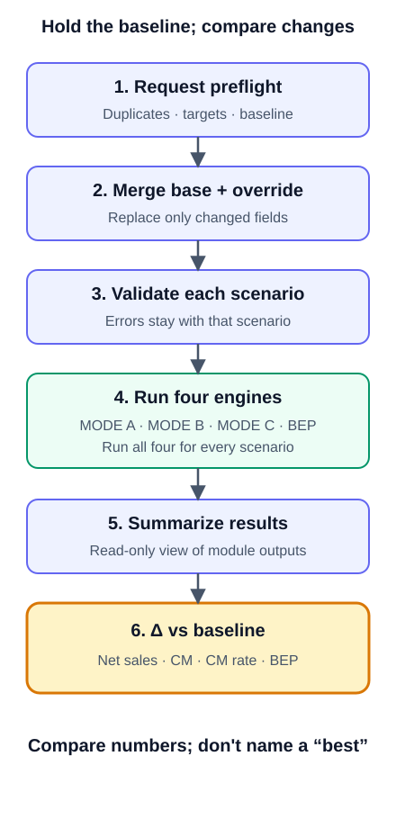

# CH14. Scenario Compare

> **Presentation key message:** Scenario comparison does not recommend the answer; it shows how changing an assumption alters the numbers against a common baseline.

## 1. Learning Objectives

Compare how changes in customer, channel, cost, and price assumptions affect economics across multiple scenarios, and interpret the delta against a baseline.

## 2. Core Concepts

Scenario Compare is a tool built to answer the question: "If we assume different prices, costs, target profitability, or fixed-cost conditions, how does each scenario's economics change?" The essential point to grasp here is that Scenario Compare is not a new calculation engine. MODE A (actual price diagnostics), MODE B (required selling price back-calculation), MODE C (allowable cost calculation), and BEP (break-even point) are already four independent engines, each running calculations by its own fixed formula. Scenario Compare does not add new formulas to these four engines. (Pricing Harness also has a Volume Profit capability that calculates operating profit at a planned sales quantity; it is covered in CH13 and is not currently among the engines Scenario Compare runs.) Instead, it is an orchestration layer that builds one baseline scenario and several variant scenarios, runs the same four engines repeatedly — once per scenario — and lines up the results side by side.

Every number Scenario Compare produces can be traced back to exactly one call among `run_mode_a` / `run_mode_b` / `run_mode_c` / `run_bep`. Scenario Compare itself defines no new price formula, no new contribution margin definition, no new break-even formula, no new VAT normalization method, and no new cost allocation rule.

## 3. Why It Matters

In practice, pricing decisions are never made from "one answer to one assumption." What happens if we raise the price by 10%? What if we lower the cost from a specific supplier? What if the market will only bear a lower price than expected? Answering these questions used to mean manually tweaking the Client Input a little at a time, rerunning each mode, and comparing the differences by eye. Scenario Compare turns this comparison work into a repeatable, reliable first-class feature — not a new calculation, but a systematic way of running the same existing calculations multiple times with controlled differences and lining up the results.

## 4. Framework / Logic

Scenario Compare adopts a "base + override" design (SPEC.md §2, Design B). Each scenario does not exist as an independent, complete document (a snapshot). Instead, there is one `base_input` (a single, ordinary Client Input), and each scenario is expressed only as a short, explicit list of overrides describing which fields differ from that base. This makes it immediately visible, from the override list itself, what actually changed between scenarios, and guarantees that every field not overridden is structurally identical across scenarios.

Overrides are addressed not by array index but by the schema's own stable identifiers (`component_id`, `item_id`), and are grouped by target type: `components` (per price component — actual price / target market price / VAT-inclusive flag / discount rate), `cost_items` (per cost item — amount / rate), `targets` (target contribution margin rate), `tax` (VAT rate), and `fx` (exchange rate). This list is a closed allowlist: fields that change a cost item's "meaning" — such as `cost_category`, `basis`, `applies_to_component`, or `allocation_rule` — and the `component_id`/`item_id` themselves, are not override targets.

Scenario Compare runs as a six-step pipeline (SPEC.md §7, matching the header comment in `scenario_compare.py` exactly):

- STEP 1 — Request-level preflight: confirms that there are at least 2 scenarios, no duplicate `scenario_id`, a `baseline_scenario_id` is specified and exists, no duplicate `component_id`/`item_id` within `base_input`, every override target actually exists, and no target is overridden twice within the same scenario, among other checks. If this step fails, the entire request becomes ERROR and no mode engine runs at all.
- STEP 2 — Base + override merge: deep-copies `base_input`, then applies overrides as pure field replacement. Omitted fields keep the base value; fields explicitly set to `null` become UNKNOWN.
- STEP 3 — Schema validation of the merged client_input: if this validation fails, only that scenario becomes ERROR and ends without running any mode, while the other scenarios each continue independently.
- STEP 4 — Runs `run_mode_a`/`run_mode_b`/`run_mode_c`/`run_bep` (all four modes run for every scenario — not just the subset relevant to that scenario's purpose).
- STEP 5 — Builds a read-only summary view from the four module results.
- STEP 6 — Computes the delta against the baseline.

The overall scenario status is determined by a three-tier rule — ERROR > INCOMPLETE > OK: if any of the four modules is ERROR, the scenario is ERROR; if none is ERROR but at least one is INCOMPLETE, the scenario is INCOMPLETE; if all are OK (or NOT_IMPLEMENTED, for modules not yet built), the scenario is OK.

## 5. Application Process

1. **Define the baseline**: Define the current state that will serve as the comparison reference (current price, current cost, current target margin, etc.) as one complete `base_input`.
2. **Designate the baseline scenario**: Explicitly designate one scenario in the list as `baseline_scenario_id`. There is no rule that makes the first scenario in the list automatically the baseline.
3. **Design variant scenarios**: Turn each assumption change you want to examine (a price increase/decrease, a change in a specific cost item, a change in channel or target margin, a change in fixed costs, etc.) into its own scenario, writing as overrides only the fields that scenario actually changes relative to the base.
4. **Secure at least 2 scenarios**: A comparison requires a minimum of 2 scenarios to be valid.
5. **Execute**: Calling `run_scenario_compare(request)` runs the six-step pipeline independently for each scenario.
6. **Interpret the results**: Read each scenario's absolute figures (mode_a/mode_b/mode_c/bep results) together with the delta against baseline (net sales, contribution margin, contribution margin rate, and break-even quantity differences).
7. **Check status**: Check each scenario's `scenario_status` alongside each delta's status (OK/UNKNOWN/NOT_APPLICABLE/ERROR), so you judge not just the numbers themselves but whether those numbers can be trusted.

## 6. Applying This in Pricing or the Harness

Scenario Compare provides exactly four delta metrics as the v0.1 minimum set (SPEC.md §14):

- `net_sales_ex_vat_delta` — the difference based on MODE A's `actual_price_ex_vat` (a value not distorted even when VAT display conventions differ)
- `contribution_margin_delta` — the difference based on MODE A's `contribution_margin`
- `contribution_margin_rate_delta` — the difference based on MODE A's `contribution_margin_rate`
- `break_even_quantity_delta` — the difference based on BEP's `break_even_quantity_exact`

Each delta reads exactly one field from exactly one mode, and is never substituted with a similarly named metric from a different mode (e.g., MODE B/C's analogous metrics). If either value is ERROR, the delta is ERROR; if either is UNKNOWN, the delta is UNKNOWN; if either is NOT_APPLICABLE, the delta is NOT_APPLICABLE; only when both values are confirmed numeric OK is the subtraction actually performed, yielding OK. Even the baseline's own self-delta is no exception — comparing a value against itself does not automatically make it 0/OK; it simply follows the status of the source metric itself (if the source is UNKNOWN, the self-delta is UNKNOWN as well).

In v0.1, Scenario Compare does not rank scenarios or recommend a "best scenario" (SPEC.md §12). This is not an incomplete implementation but an intentional scope limit — pricing decisions depend on information this calculation layer has no access to, such as market positioning, customer value perception, and competitive dynamics. Scenario Compare's output is, strictly, a descriptive comparison that places numbers side by side and makes the differences visible.

In the same vein, a scenario in Scenario Compare cannot currently vary the planned sales quantity (`planned_quantity`). Volume Profit is not yet connected to Scenario Compare, and the Volume Profit specification (`docs/features/volume_profit/SPEC.md`) lists per-scenario planned-quantity overrides as the natural next step while stating that it needs its own specification revision. To compare profit at different volumes, you currently have to run Volume Profit (CH13) separately for each planned quantity.

## 7. Practical Checkpoints

- Did you explicitly designate the baseline? (Make sure your team also understands that the first scenario does not automatically become the baseline.)
- Does each scenario's override list contain only the assumption changes you actually intended to examine? (Check that unrelated fields weren't accidentally changed along with it.)
- Is the baseline scenario itself valid? If the baseline fails schema validation (a STEP 3 failure), the other scenarios' absolute figures remain intact, but all deltas are marked ERROR (the `BASELINE_SCENARIO_INVALID_FOR_DELTA` warning).
- Don't assume a delta of 0 means "nothing changed." A delta can be 0 simply because that particular metric is unrelated to the override target (e.g., if only fixed costs were changed, all of MODE A/B/C's deltas are 0 while only BEP changes), and even within the same scenario, delta status can differ metric by metric.
- If a delta's status is UNKNOWN/NOT_APPLICABLE/ERROR, don't misread it as the number 0. `value: null` means the calculation could not be performed — not that there was no change.
- A scenario with multiple components (two or more price components) will structurally cause BEP to return a `MULTI_COMPONENT_BEP_NOT_SUPPORTED` error — this is a known constraint of the existing BEP module that Scenario Compare does not work around or hide.

## 8. Key Takeaways

Scenario Compare is an orchestration layer built on top of MODE A/B/C/BEP: it defines one baseline scenario and multiple variant scenarios using the base+override approach, reruns the same four existing engines, and compares the results side by side. It creates no new price or cost formulas, and every output number can be traced back to an existing mode call. It shows change relative to the baseline through four delta metrics (net sales, contribution margin, contribution margin rate, and break-even quantity), but it never judges which scenario is "better."

## 9. Practical Questions

- What should we define as the baseline for the scenarios we're currently comparing — the current price, or some other reference point?
- Among the changes under review (price, cost, channel, target margin, fixed costs), which combination has the most direct impact on the actual decision?
- Looking at metrics whose delta came out as 0 together with metrics that changed significantly, what does that combination suggest for the decision?
- For any items whose delta came out UNKNOWN/NOT_APPLICABLE, what input gap or structural constraint is causing it, and how can that be resolved?

## Source Map

- MN: MN07 (concept)
- KM: KM063
- Harness: core/engine/scenario_compare.py (run_scenario_compare), docs/features/scenario_compare/{SPEC,METHOD,CASE}.md
