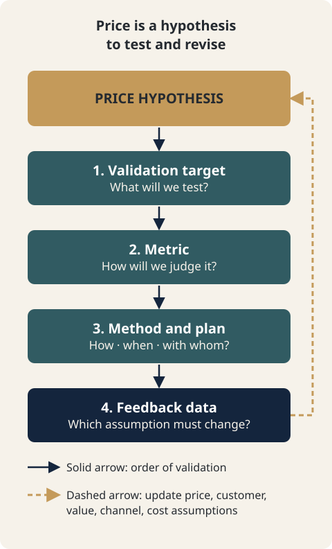

# CH15. Validating Price Hypotheses and Making Decisions

> **Presentation key message:** Price is not a number calculated once and finalized; it is a living hypothesis continually tested and revised with market data.

## 1. Learning Objectives

Treat price not as a confirmed truth but as a hypothesis to be validated; design the next experiment using the four elements of validation design (what to verify, metric, method and plan, feedback data); and understand where the roles of AI and humans are bounded in the process of validating price.

## 2. Core Concepts

The chapters up to this point in this handbook have covered how to calculate price — cost structure, Contribution Margin, MODE A/B/C, segment-specific pricing, negotiation response, and so on. But no matter how a price was calculated, the resulting number is not a confirmed fact — it is a hypothesis. The statement "at this price, the customer will pay while we still hit our target margin" is not a calculation; it is a proposition that must be validated.

Execution is not the stage where a plan is simply followed — it is the validation stage where you find where the plan diverges from reality. Setting a price and putting it in front of the market works the same way. What happens after a price is presented — whether the quote is accepted, how much ground is given in negotiation, whether repeat purchases follow — is data that tells you whether your price hypothesis was right, and reading that data and moving on to the next hypothesis is the subject of this chapter.

A business plan is not a finished set of facts but a structure of interconnected hypotheses. The hypothesis that a certain customer will pay this price, and the hypothesis that this price will work in a specific channel or segment, are connected to hypotheses about other components — customer, value, channel, cost. This is why it is often impossible to judge a price alone as "right" or "wrong" in isolation.

To turn a hypothesis into a testable experiment, four items must be connected in sequence.

- **What to verify**: What exactly is the price hypothesis you want to check right now?
- **Metric**: What will tell you whether that hypothesis held?
- **Method and plan**: By what method, when, and with whom will you check it?
- **Feedback data**: Which price component will the result be fed back into as grounds for revision?

Without these four items connected, "watch how the market reacts" remains a vague observation. Connected, price execution becomes an experiment that makes the next decision more accurate.

## 3. Why It Matters

No matter how precise a price calculation is, if the result is never validated against reality, it never turns into business knowledge. Without a link between execution and learning, the volume of quotes sent and negotiations run may increase, but the next pricing decision does not get any better.

Also, the strength of a good business plan lies not in polished prose but in the evidence behind "why we decided on this price." Back-data such as customer interviews, competitor price research, actual quote outcomes, and records of failed negotiations builds a track record of judgment. The validation design covered in this chapter is the procedure for deliberately accumulating that back-data.

Finally, validation does not presuppose a finished product or a sweeping price overhaul. The principle that you can design small, repeatable validations within an affordable level of risk applies to price just as it does elsewhere. Before changing the price across an entire customer base, you can first check the hypothesis in one segment, one channel, or one quote.

## 4. Framework / Logic

The logic of this chapter runs through three layers.

**Layer 1 — Price is a hypothesis.** Execution is the stage that validates a plan, and price, as one component of that plan, is subject to validation. If you treat price as confirmed truth, then when market reaction disproves the hypothesis, you end up filing it away as "bad luck" rather than reading it as a "learning signal."

**Layer 2 — Validation is designed with four elements.** The four items — what to verify, metric, method and plan, feedback data — turn a vague "let's watch how the price is received" into a decidable experiment. That said, even where the source material lays out how to connect these four items, it does not offer universal thresholds such as "N cases is enough" or "X% close rate is a pass." The sufficiency of evidence has to be decided case by case, weighing both the size of the decision being validated and the risk if it turns out wrong.

**Layer 3 — Validation results can lead to pivoting.** Pivoting happens not because a new idea occurred to someone, but because data shook an existing hypothesis. The same is true in price validation. If the data shakes a price hypothesis, that finding becomes grounds not just for revisiting price itself but for returning to earlier chapters that dealt with assumptions about customer, value, and channel.

Running through all three layers is the principle that "the size of an experiment does not need to match the size of the business." Before changing an entire price, you can check it first in one component, one segment, one channel.

## 5. Application Process

1. **Write the price hypothesis as a sentence.** State it in a form that can be judged true or false, such as "This segment will pay this price" or "In this channel, deals will close without a discount."
2. **Decide what to verify.** Among the hypotheses above, narrow down to whichever is most uncertain right now, or whichever would have the biggest impact if wrong.
3. **Decide the metric.** Choose an indicator directly tied to the hypothesis from among those you can actually track based on the source material — price acceptance, discount depth in negotiation, quote close rate, repeat purchase rate, and so on.
4. **Set the method and plan.** Give priority to methods that can be checked without a finished product or a full-scale price redesign — interviews, VOC, sending an actual quote, a small-scale channel test. Set the sample and time frame within an affordable level of risk.
5. **Execute and record the results.** Don't leave the record at success/failure alone — record specifically which assumptions held and which were off.
6. **Feed it back as data.** If the validation result shook a price assumption, determine which component it belongs to — cost structure, value-based pricing, or segment/channel — and use it as grounds for reopening that component.
7. **Separate the roles of AI and humans.** Organizing interview notes, summarizing quote data, comparing patterns, and drafting experiment scenarios are areas where AI can add speed. But which risks to take on, and what to prioritize when field data and AI inference conflict, are decisions the entrepreneur and planner must make in the end.

## 6. Applying This in Pricing or the Harness

This chapter has a limitation that needs to be stated honestly. The current Pricing Harness has no separate data structure for storing or tracking price validation or feedback data. A dedicated feature for cumulatively recording validation results, a standalone Executive Dashboard, a consulting report generator, and a Quotation generator are all not yet implemented.

What the Harness actually provides is only the Scenario Compare feature covered in CH14. It was not designed specifically for validation, but it can be used informally to compare "what happens if the price hypothesis changes." For example, if you set the current price as one scenario and the alternative price you want to validate as another, and compare the MODE A/B/C results side by side, you can answer the question "if this price hypothesis is correct, how does Contribution Margin change?" That said, this simulates a validation result in advance — it is not a function that collects, records, and tracks actual market response data.

So the work of systematically accumulating the four elements of validation design set out in this chapter — feedback data above all — and feeding it automatically into the next pricing decision currently has to be carried out through a manual or separately documented procedure, such as this handbook's worksheet (CH15-worksheet.md). This functional gap remains a future Harness expansion task, and this handbook does not describe a feature as existing when it does not.

## 7. Practical Checkpoints

- Do not treat price as "already calculated, so it's settled." A calculated price is the starting point of validation, not the endpoint.
- If even one of the four elements of validation design (what to verify, metric, method and plan, feedback data) is missing, what you have is not an experiment but a vague observation.
- How much evidence validation needs differs by business and by the size of the decision. There is no universal "N cases is enough" standard, so set your own bar by weighing it against the risk of being wrong.
- Prefer small, repeatable validation within affordable risk over hard-to-reverse experiments like an MVP launch or a full-scale price overhaul.
- When a validation result shakes a price assumption, don't stop at revising the price page — check which other component's assumptions (cost, value, segment, channel) need to change along with it.
- AI-generated summaries, comparisons, and drafts are inputs to judgment, not judgment itself. When field data and AI inference conflict, field data and the human's final judgment take priority.
- Work from the premise that the current Harness has no feature for storing validation data, and manage validation records in a separate document (such as the worksheet).

## 8. Key Takeaways

This chapter — and Part 3 of this handbook as a whole — converges on one message. Price is not a number you calculate once and lock in; it is a living hypothesis that you keep validating and revise when needed. The four elements of validation design are the tool that turns that validation from vague observation into a procedure that makes the next decision more accurate, and AI is only a supporting layer that speeds up that procedure — never the party who makes the final call.

This brings all 15 chapters of this handbook to a close. It is not unusual for data from price validation to shake not the price itself but an earlier assumption further upstream — whether the cost structure is really at that level, whether value-based pricing actually works for the customer, whether the revenue model fits that channel or segment. If such a signal appears, it does not mean you should reread this handbook from the start. It means reopening the specific chapter the data points to — the cost structure chapter if it's a cost issue, the value-based pricing chapter if that assumption was shaken, the revenue model chapter if that assumption was shaken — and updating only that part. Execution is not something you plan once and finish; it is the process of reopening specific parts of the plan as reality informs you, and price, too, remains one component that keeps being validated within that process.

## 9. Practical Questions

- What hypothesis does the price I'm currently using rest on? Can you write that hypothesis in one sentence?
- If that hypothesis were wrong, how would you know? Can you state the metric concretely right now?
- Within the smallest, most affordable level of risk, what is the way to check this price hypothesis?
- If a recent price-related outcome diverged from expectation (a discount demand, a rejection, an unusually easy close), which component's assumptions (cost, value, segment, channel) does that signal shake?
- Can you currently distinguish which parts of price validation to hand to AI and which parts a human must decide, no exceptions?

## Source Map

- MN: MN08
- KM: KM064, KM065, KM066, KM067, KM068, KM071
