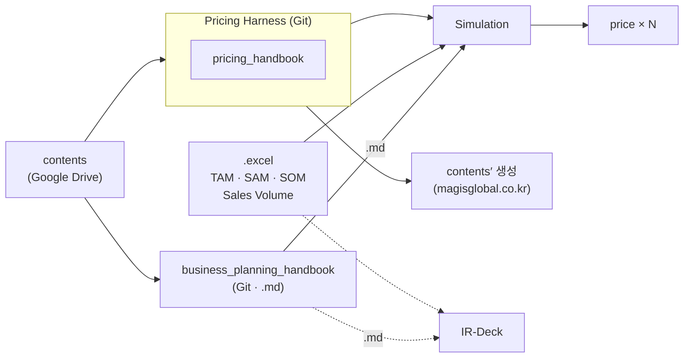

# Pricing Strategy Handbook v0.1 (한국어)

> [🇺🇸 Read in English](../en/README.md) · [⬅ 메인으로](../README.md)

## 이 교재의 목적

가격을 단순 숫자 결정이 아니라 비즈니스모델·고객가치·경쟁·채널·비용·수익모델·사업타당성이 연결된 구조로 다루는 실무형 교재다. Knowledge Source(가격전략 이론)와 Tool Source(Pricing Harness 실행 도구)를 하나의 canonical Handbook으로 결합했다.

## 대상 독자

가격전략을 체계적으로 배우고 싶은 창업자·컨설턴트·사업기획 담당자. 특정 산업 경험을 전제하지 않는다.

## 이 교재의 위치

이 프로젝트에서 **Harness는 Pricing Harness 하나만 가리킨다.** 핸드북류는 하네스에 들어가는 `.md` 지식 소스이며, 하네스 자체가 아니다.

## 3-Part 구조

### Part I — Pricing Strategy

- [CH01. 가격은 비즈니스모델의 결과다](chapters/CH01.md)
- [CH02. 원가와 비용구조](chapters/CH02.md)
- [CH03. 가격결정의 두 논리 — 고객가치와 경쟁](chapters/CH03.md)
- [CH04. 채널과 고객관계가 바꾸는 가격구조](chapters/CH04.md)
- [CH05. 수익원과 가격 메커니즘](chapters/CH05.md)
- [CH06. 세 재무 렌즈와 사업타당성으로의 연결](chapters/CH06.md)

### Part II — Feasibility Bridge

- [CH07. 유효시장과 나의 시장](chapters/CH07.md)
- [CH08. 정성에서 정량으로 — 유효시장 추정과 P×Qty](chapters/CH08.md)
- [CH09. QCD·추정손익 해석과 반복검증](chapters/CH09.md)

### Part III — Pricing Harness

- [CH10. MODE A — 현재가격 진단](chapters/CH10.md)
- [CH11. MODE B — 목표가격 역산](chapters/CH11.md)
- [CH12. MODE C — 허용원가 역산](chapters/CH12.md)
- [CH13. BEP — 손익분기점](chapters/CH13.md)
- [CH14. Scenario Compare — 시나리오 비교](chapters/CH14.md)
- [CH15. 가격가설의 검증과 의사결정](chapters/CH15.md)

## Worksheet / Example

각 Chapter는 실습 [워크시트](manual/) 1개를 포함한다(총 15개). [사례](examples/)는 원자료(Knowledge Module 또는 Pricing Harness CASE 문서)에 실제로 존재하는 것만 수록했다(총 13개) — 새로 창작한 사례는 없다. 각 사례는 연습 문제로도 쓸 수 있다. 먼저 "문제"(또는 "생각해 보기")를 직접 풀어 본 뒤 "정답과 풀이 보기"로 확인한다. 문제는 사례의 숫자와 서술에서만 만들었다.

## 출처 정책

이 교재는 두 종류의 Source를 결합한다.
- **Knowledge Source**: 저자가 운영하는 내부 Knowledge Base(가격전략 이론)
- **Tool Source**: Pricing Harness(가격 계산·시나리오 비교 실행 도구)

외부 리서치·웹검색·일반지식 보충 없이 만들어졌다. 자세한 Chapter-출처 대응관계는 [`../source-map.md`](../source-map.md)를 참고한다.

## 알려진 한계 (정직하게 밝힘)

일부 Chapter(CH03, CH05, CH15)는 원자료 또는 도구가 아직 다루지 않는 범위를 포함한다 — 근거 없이 채우지 않고 "아직 없음/미확정"으로 명시했다. 자세한 내용은 각 Chapter의 본문과 [`../source-map.md`](../source-map.md)를 참고한다.

## 버전

**v0.1** — Human Review를 거친 Korean Private Release Candidate. 아직 공개되지 않았다.
