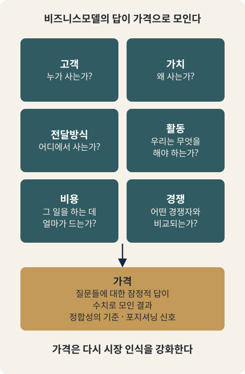

# CH01. 가격은 비즈니스모델의 결과다

> **발표 핵심 메시지:** 가격은 마지막에 붙이는 숫자가 아니라, 고객·가치·전달방식·비용이 서로 맞물린 비즈니스모델의 결과다.

## 1. 학습목표

이 장을 마치면 다음을 할 수 있다.

- 가격을 "제품이 완성된 뒤 마지막에 붙이는 숫자"가 아니라 비즈니스모델의 결과로 이해할 수 있다.
- 가격이 고객·문제·가치·전달방식·비용이라는 여러 요소를 종합적으로 반영한다는 것을 설명할 수 있다.
- 가격이 비즈니스모델 여러 요소 사이의 정합성을 확인하는 기준이라는 관점을 자신의 사업에 적용할 수 있다.
- 이후 Chapter에서 다룰 가격 구성요소(고객·가치·경쟁·비용)가 왜 이 순서로 이어지는지 조망할 수 있다.

## 2. 핵심개념

가격을 제품이 완성된 뒤 마지막에 붙이는 숫자로 생각하면 사업기획의 중요한 연결고리를 놓치게 된다. 가격은 고객이 누구인지, 그 고객이 어떤 문제를 가지고 있는지, 어떤 가치를 제공하는지, 어떤 방식으로 그 가치를 전달하는지, 그리고 그 과정에 얼마의 비용이 들어가는지를 종합적으로 반영하는 결과에 가깝다.

비즈니스모델을 가치창출, 가치전달, 수익모델이라는 세 범주로 보았을 때 가격은 수익원에만 머무르지 않는다. 어떤 가격을 지불할 고객세그먼트인지, 그 가격만큼의 가치가 있는지, 그 가격을 유지할 수 있는 채널인지, 고객관계를 유지하는 비용을 감당할 수 있는지까지 함께 보아야 한다. 가격은 비즈니스모델의 여러 요소가 서로 모순 없이 연결되어 있는지를 확인하는 정합성의 기준이 된다.

## 3. 왜 중요한가

핵심자원과 핵심활동은 비용구조를 만들고, 채널과 고객관계는 고객이 체감하는 가치와 판매비용을 바꾸며, 파트너십은 자원 확보와 협상력, 경쟁 포지션에 영향을 준다. 이 모든 요소를 고려하지 않고서는 시장이 납득할 수 있는 "살아있는 가격"을 정하기 어렵다.

이 관점에서 가격은 독립적인 변수가 아니다. 고객에게 제공하는 가치가 커지면 더 높은 가격을 정당화할 가능성이 생기지만, 그 가치를 구현하기 위해 더 비싼 자원과 활동이 필요할 수도 있다. 직접 판매를 선택하면 유통 마진을 줄일 수 있지만 고객획득과 운영을 스스로 감당해야 한다. 간접 채널을 선택하면 시장 접근성이 높아질 수 있으나 수수료와 유통마진이 가격구조 안으로 들어온다. 파트너를 활용하면 부족한 자원을 보완할 수 있지만 파트너에게 지급하는 경제적 대가와 협상력도 함께 검토해야 한다.

가격을 이렇게 보면, "얼마를 받을 것인가"라는 질문에 답하기 전에 이미 몇 가지 전제가 정리되어 있어야 한다는 점이 드러난다. 누가 지불하는가라는 문제다. 사업기획에서는 이미 이 전제를 다루는 별도의 논의가 있다. 고객을 정의하는 일은 곧 시장의 경계를 정하는 일이며, 같은 상품이라도 누구를 고객으로 선택하느냐에 따라 시장의 이름과 구조가 달라진다. 또한 문제를 겪는 사용자, 구매를 결정하는 구매자, 비용을 지불하는 지불자는 B2C에서는 한 사람에게 모일 수 있지만 B2B·B2G에서는 분리되는 경우가 많으며, 거래유형(B2C·B2B·B2G)에 따라 구매를 움직이는 논리 자체가 다르다. 가치제안 역시 제품의 장점을 요약한 문장이 아니라 특정 고객의 문제, 제공하는 해법, 기존 대안 대비 선택이유가 하나의 논리로 연결된 상태이며, 고객과 구매구조가 달라지면 같은 기술·제품이라도 가치제안은 달라질 수 있다. 이 세 가지 전제(고객·구매자 역할·가치제안)는 이 Handbook의 다른 곳에서 이미 다루었으므로, 이 장에서는 그 결론만 짧게 확인하고 넘어간다.

## 4. Framework / Logic

가격을 결정하는 논리는 하나의 계산이 아니라 여러 질문이 겹쳐 있는 구조로 볼 수 있다. "가격은 얼마가 적당한가?"라는 질문 안에는 "누가 사는가?", "왜 사는가?", "어디에서 사는가?", "우리는 무엇을 해야 하는가?", "그 일을 하는 데 얼마가 드는가?", "어떤 경쟁자와 비교되는가?"라는 질문이 겹쳐 있다. 가격은 이 질문들에 대한 잠정적 답이 수치로 모인 결과에 가깝다.

경쟁을 참고하는 경우에도 이 논리는 그대로 적용된다. 경쟁 기반 가격결정은 업계 평균가격을 복사하는 방식이 아니라, 동일한 고객세그먼트에게 유사한 고객가치를 제공하는 솔루션을 먼저 정의한 뒤 비교하는 방식이다. 따라서 경쟁가격을 보기 전에 고객과 가치, 대체재의 범위를 먼저 정해야 한다. 동시에 가격은 고객에게 품질과 브랜드의 위치를 해석하게 만드는 포지셔닝 신호이기도 하다. 낮은 가격이 시장진입에 유리해 보일 수 있지만, 한 번 저가 브랜드로 인식되면 이후 프리미엄 시장으로 이동하는 데 큰 비용과 시간이 필요할 수 있다. 반대로 고가전략도 가격만 올린다고 성립하지 않으며, 높은 가격을 정당화할 제품과 서비스, 고객경험, 채널, 브랜드가 함께 있어야 한다. 가격은 포지셔닝의 결과이면서 동시에 그 포지셔닝을 강화하는 수단이다.

## 5. 적용 절차

1. **전제 확인.** 고객을 정의했는가, 사용자·구매자·지불자 역할을 구분했는가, 거래유형(B2C·B2B·B2G)에 따른 구매논리를 반영했는가, 가치제안을 하나의 논리로 정리했는가를 먼저 점검한다.
2. **가격을 결과로 재배치.** 가격을 제품이 완성된 뒤 붙이는 숫자가 아니라, 고객·문제·가치·전달방식·비용을 종합한 결과로 다시 본다.
3. **비즈니스모델 요소와의 연결 확인.** 핵심자원·핵심활동(비용구조), 채널·고객관계(체감가치와 판매비용), 파트너십(자원·협상력·경쟁 포지션)이 가격과 어떻게 맞물리는지 각각 짚어본다.
4. **경쟁과 포지셔닝 반영.** 비교대상이 되는 경쟁자를 "같은 고객세그먼트에 유사한 가치를 제공하는 솔루션"으로 먼저 정의한 뒤, 가격이 어떤 포지셔닝 신호를 보내는지 검토한다.
5. **정합성 점검.** 이렇게 정리된 가격이 비즈니스모델의 다른 요소들과 모순 없이 연결되는지 확인한다.

## 6. Pricing 또는 Harness 적용

이 장에는 별도의 계산 도구나 Harness가 없다. Part Ⅰ은 가격을 바라보는 관점을 정리하는 Knowledge 전용 장이기 때문이다. 대신 이 장에서 정리한 관점은 이후 Chapter에서 실제 가격을 계산하고 검증하는 작업의 전제가 된다. 뒤에 이어질 Chapter들이 다룰 고객가치, 경쟁 대비 포지셔닝, 비용구조 같은 요소는 모두 이 장에서 확인한 원칙, 즉 가격은 비즈니스모델 여러 요소의 정합성을 확인하는 기준이라는 원칙 위에서 구체적인 숫자로 번역된다. 따라서 이 장의 결론은 이후 Chapter에서 사용할 각 계산·점검 절차의 입력전제로 이어진다.

## 7. 실무 체크포인트

- 가격을 정하기 전에 고객·구매자 역할·거래유형·가치제안이 이미 정리되어 있는가.
- 가격을 "얼마 받을 것인가"로만 묻지 않고, 그 가격이 비즈니스모델의 다른 요소(자원·활동·채널·고객관계·파트너십)와 모순되지 않는지 함께 묻고 있는가.
- 경쟁가격을 참고할 때, 업계 평균을 그대로 따르지 않고 "같은 고객에게 유사한 가치를 제공하는 솔루션"을 먼저 정의했는가.
- 지금의 가격이 시장에서 어떤 포지셔닝 신호로 해석될지 검토했는가.

## 8. 핵심정리

- 가격은 제품이 완성된 뒤 마지막에 붙이는 숫자가 아니라, 고객·문제·가치·전달방식·비용을 종합적으로 반영하는 결과다.
- 가격은 수익원에만 머무르지 않으며, 비즈니스모델의 여러 요소가 서로 모순 없이 연결되어 있는지를 확인하는 정합성의 기준이다.
- 핵심자원·핵심활동, 채널·고객관계, 파트너십은 각각 비용구조, 체감가치와 판매비용, 협상력·경쟁 포지션을 통해 가격과 연결된다.
- "가격은 얼마가 적당한가?"라는 질문 안에는 누가 사는가, 왜 사는가, 어디에서 사는가, 우리는 무엇을 해야 하는가, 비용은 얼마인가, 경쟁자와 어떻게 비교되는가라는 여러 질문이 겹쳐 있다.
- 경쟁 기반 가격결정은 경쟁자의 가격을 복사하는 것이 아니라, 같은 고객에게 유사한 가치를 제공하는 솔루션을 먼저 정의한 뒤 비교하는 작업이다.
- 가격은 포지셔닝의 결과이면서 동시에 그 포지셔닝을 강화하는 수단이다.

## 9. 실무 질문

- 지금 내가 정하려는 가격은 "제품이 다 만들어진 뒤 붙이는 숫자"인가, 아니면 고객·문제·가치·전달방식·비용을 종합한 결과인가?
- 이 가격은 우리 비즈니스모델의 핵심자원·핵심활동·채널·고객관계·파트너십과 모순 없이 연결되는가?
- 우리가 비교하고 있는 "경쟁자"는 실제로 같은 고객세그먼트에 유사한 가치를 제공하는 솔루션인가?
- 이 가격은 고객에게 어떤 품질·브랜드 포지션으로 해석될 가능성이 있는가?
- 고객·구매자 역할·거래유형·가치제안이라는 전제는 이미 충분히 정리되어 있는가, 아니면 가격을 논의하기 전에 먼저 다시 확인해야 하는가?

## Source Map

- MN: MN06 (primary), MN03/MN04 (prerequisite, cited briefly)
- KM: KM043 (primary), KM018/KM019/KM020/KM031/KM047 (prerequisite)
