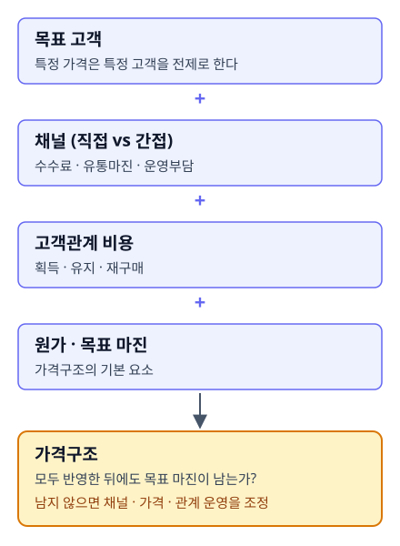

# CH04. 채널과 고객관계가 바꾸는 가격구조

> **발표 핵심 메시지:** 지속 가능한 가격은 원가와 마진뿐 아니라 채널비용과 고객관계 비용까지 감당해야 한다.

## 1. 학습목표

이 장을 마치면 채널 유형(직접채널·간접채널)과 고객관계 비용(획득·유지·재구매)이 가격·마진 구조에 미치는 영향을 설명할 수 있다.

## 2. 핵심개념

가격은 혼자 움직이지 않는다. 특정 가격은 특정 고객을 전제로 하고, 그 고객에게 접근하는 채널을 전제로 하며, 그 채널의 수수료와 운영비는 다시 원가와 마진을 바꾼다. 간접채널(유통사, 플랫폼, 위탁판매 등)을 활용하면 더 넓은 시장에 접근할 수 있지만 유통마진과 수수료가 발생한다. 반대로 직접채널(D2C, 직접 제안영업 등)은 단위당 이익률을 높일 수 있지만, 고객을 스스로 모으고 배송과 서비스까지 감당해야 한다는 부담이 따른다. 어느 한쪽이 항상 우월한 것이 아니라 목표 고객, 상품 특성, 보유 자원, 성장 속도에 맞춰 판단해야 하는 문제다.

가격구조에는 채널비용만이 아니라 고객관계를 유지하는 데 필요한 재원도 들어가야 한다. 고객관계는 친절한 응대에 그치지 않는다. 고객을 획득하고, 구매경험을 관리하고, 재구매와 추가구매로 이어지게 만드는 일련의 활동이며, 여기에는 인력과 시스템, 프로모션 비용이 들어간다. 즉 수익모델이 정립되었다는 말은 가격표를 하나 정했다는 뜻이 아니라, 원가와 마진뿐 아니라 채널비용과 고객관계 유지비용까지 가격구조 안에서 함께 고려했다는 뜻에 가깝다.

## 3. 왜 중요한가

채널을 고려하지 않고 가격을 정하면 팔수록 손해가 나는 구조가 될 수 있다. 수수료와 유통마진을 빼고 나면 실제로 손에 남는 돈이 원가조차 감당하지 못하는 경우가 생기기 때문이다. 같은 이유로, 고객관계 유지비용(획득·유지·재구매 비용)을 가격구조에 반영하지 않으면 겉으로는 마진이 남는 것처럼 보여도 실제로는 지속 가능하지 않은 가격일 수 있다. 채널과 고객관계는 서로 다른 요소이지만, 둘 다 "얼마에 팔 것인가"라는 질문 이전에 "이 가격이 누구에게, 어떤 경로로, 어떤 관계를 통해 전달되는가"를 먼저 묻게 만든다는 점에서 같은 원칙을 공유한다.

## 4. Framework / Logic

두 KM이 공유하는 논리 구조는 다음과 같다.

1. 가격은 고정된 숫자가 아니라 비즈니스모델의 다른 요소(고객, 채널, 생산능력, 주문량, 관계비용, 파트너)에 의해 계속 수정되는 전략변수다.
2. 채널 선택(직접 vs 간접)은 시장 접근성과 단위당 이익률 사이의 트레이드오프를 만든다.
3. 고객관계 유지비용(획득·유지·재구매)은 원가·마진과 별개로 존재하는 비용 항목이며, 가격구조 설계 시 함께 반영해야 한다.
4. 같은 제품이라도 채널구조와 고객관계 비용이 달라지면 적정 가격과 마진 구조도 달라진다.

## 5. 적용 절차

1. 목표 고객과 상품 특성을 확인하고, 이 고객에게 접근 가능한 채널(직접/간접)을 나열한다.
2. 채널별 수수료·유통마진·운영부담을 확인한다.
3. 고객 획득·유지·재구매에 필요한 활동(인력, 시스템, 프로모션)과 그 비용을 확인한다.
4. 원가, 채널비용, 고객관계 유지비용을 모두 반영했을 때도 목표 마진이 남는지 검토한다.
5. 남지 않는다면 채널 구성, 가격, 또는 고객관계 운영방식 중 무엇을 조정할지 판단한다.

## 6. Pricing 또는 Harness 적용

Pricing Harness(pricing-harness-public) 도구의 `core/schemas/client_input.schema.json`에는 `cost_item.applies_to_component`, `allocation_rule` 필드가 스키마 수준으로 정의되어 있어, 향후 비용 항목을 채널이나 구성요소별로 배분할 수 있는 구조적 여지는 마련되어 있다. 그러나 현재 시점에서 채널별 비용 배분을 실제로 계산·분석하는 기능은 구현되어 있지 않다. 즉 이 필드는 아직 입력 스키마에만 존재하며, 이를 활용해 채널별 마진이나 수수료 영향을 자동 산출하는 분석 로직은 없다. 이 장의 내용을 실무에 적용할 때는 현재로서는 수기 또는 별도 스프레드시트로 채널별 원가·수수료·고객관계 비용을 정리해야 하며, Harness가 이를 자동화해줄 것으로 기대해서는 안 된다. 이는 현재 도구의 한계이며, 향후 개발이 필요한 영역으로 별도 기록해 둘 필요가 있다.

## 7. 실무 체크포인트

- 채널별 수수료·유통마진을 가격 설계 이전에 확인했는가.
- 직접채널 운영에 필요한 고객 획득·배송·서비스 역량을 실제로 보유하고 있는가.
- 고객 획득·유지·재구매에 드는 인력·시스템·프로모션 비용을 가격구조에 반영했는가.
- 채널구조나 주문량이 바뀌었을 때 가격을 재검토하는 절차가 있는가.

## 8. 핵심정리

가격은 원가와 목표 마진만으로 정해지지 않는다. 채널의 수수료·유통마진과 고객관계를 유지하는 데 드는 비용까지 반영해야 실제로 지속 가능한 가격구조가 만들어진다. 채널과 고객관계는 가격이 계속 검토되어야 하는 전략변수임을 보여주는 두 축이다.

## 9. 실무 질문

- 우리 제품/서비스는 어떤 채널(직접/간접)을 통해 고객에게 전달되고 있으며, 그 채널의 수수료 구조는 얼마인가?
- 고객을 획득하고 재구매로 이어지게 만드는 데 실제로 얼마의 비용이 들고 있으며, 이는 현재 가격구조에 반영되어 있는가?

## Source Map
- MN: MN06
- KM: KM048, KM049
