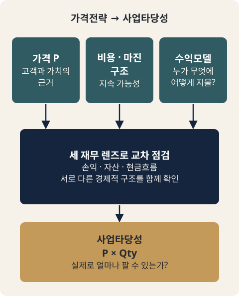

# CH06. 세 재무 렌즈와 사업타당성으로의 연결

> **발표 핵심 메시지:** 가격 P, 비용·마진 구조, 수익모델이 정리되어야 손익·자산·현금흐름을 거쳐 사업타당성을 검증할 수 있다.

## 1. 학습목표

손익·자산가치·현금흐름이라는 세 재무 관점을 구분하여 하나의 사업을 다각도로 읽을 수 있고, 가격·비용·수익모델이 정리되었을 때 다음 단계인 사업타당성 검증으로 넘어갈 준비가 되었는지를 판단할 수 있다.

## 2. 핵심개념

수익모델을 볼 때 흔히 손익계산서의 마진만 떠올리기 쉽지만, 재무 3표(손익계산서·재무상태표·현금흐름표)에서 착안하면 세 개의 렌즈로 같은 사업을 다르게 볼 수 있다. 손익 관점, 자산 관점, 현금흐름 관점이다.

이 구분은 전통적인 회계분류를 그대로 사업모델 유형으로 옮기려는 것이 아니다. "어디에서 경제적 가치를 만들고 있는가?"를 다른 각도에서 바라보기 위한 실무적 사고도구다.

가격과 수익모델을 여기까지 설계했다면, 다음 질문은 "그 가격으로 실제 얼마를 팔 수 있고, 그 사업은 지속 가능한가?"로 바뀐다. 이것이 사업타당성 검증의 출발점이며, 그 출발점으로 넘기기 위해 정리되어야 하는 핵심 입력값이 있다.

## 3. 왜 중요한가

세 렌즈는 서로 대체하는 것이 아니다. 하나의 사업을 손익, 자산, 현금흐름 관점에서 동시에 보면 같은 사업의 다른 경제적 구조가 드러난다. 제품판매 마진만을 수익모델의 전부로 보면 경쟁심화나 상품수명주기 변화에 취약해질 수 있다. 초기 사업기획 단계에서는 "매출이 얼마인가?"만 묻기보다 "무엇이 축적되는가?", "현금은 언제 들어오고 나가는가?"를 함께 물어야 수익모델을 더 입체적으로 볼 수 있다.

또한 가격·비용·수익모델을 설계하는 작업에는 끝이 있다. 그 작업이 끝났다고 판단할 기준 없이 막연히 다음 단계(시장규모 추정, 사업타당성 검증)로 넘어가면, 근거가 부실한 상태에서 유효시장 계산에 들어가게 된다. 무엇이 정리되어야 다음으로 넘어갈 수 있는지 기준을 아는 것이 이번 장의 목적이다.

## 4. Framework / Logic

**세 재무 렌즈**

- **손익 관점**: 가장 익숙한 관점이다. 상품이나 서비스를 판매하여 매출을 만들고, 비용을 제외한 이익을 남기는 구조를 본다. 가격, 판매량, 원가, 판매관리비, 마진이 핵심 변수다.
- **자산 관점**: 사업활동을 통해 보유자산의 가치가 어떻게 상승하는지를 본다. 일상적인 영업이익만 보면 매력적이지 않을 수 있지만, 사업을 통해 자산가치를 올리고 향후 매각하는 구조까지 고려하면 경제적 의미가 달라진다. 당기 손익만으로 판단하지 말고, 사업과정에서 어떤 자산이 축적되는지를 함께 봐야 한다.
- **현금흐름 관점**: 손익과 다른 질문을 던진다. 매출이 잡히더라도 실제 현금이 늦게 들어오거나 비용을 먼저 지급해야 한다면 자금압박이 생길 수 있다. 반대로 고객 결제대금을 일정기간 보유한 뒤 판매자에게 정산하는 구조에서는, 자금이 머무르는 시간과 흐름 자체가 중요한 사업구조가 된다.

**가격에서 사업타당성으로 넘어가는 세 가지 입력값**

가격과 수익모델 설계가 끝났다고 판단하려면, 가격이 어떤 원가구조를 전제로 하는지, 고객이 어떤 가치를 인정하는지, 경쟁·채널·고객관계가 그 가격과 마진을 어떻게 바꾸는지를 설명할 수 있어야 한다. 이를 다음 단계로 넘기는 핵심 입력값은 세 가지로 정리된다.

1. 고객과 가치에 근거한 가격 P
2. 그 가격에서 사업을 지속할 수 있게 만드는 비용과 마진 구조
3. 고객이 무엇에 어떻게 비용을 지불하는지를 설명하는 수익모델

이 세 가지가 정리되지 않았다면 시장규모 계산으로 넘어가는 것은 아직 이르다.

매출과 유효시장 규모는 가격과 판매수량의 곱으로 설명할 수 있다. 다만 QCD의 Q(Quality)와 판매수량의 Q(Quantity)가 혼동되지 않도록, 이 교재에서는 판매수량을 Qty로 표기한다. 이후 단계(Part II)에서는 P×Qty를 출발점으로 추정손익, QCD, 유효시장, B2C·B2B·B2G별 시장추정을 본격적으로 다룬다.

## 5. 적용 절차

1. 검토 중인 사업을 손익 관점에서 정리한다: 가격·판매량·원가·판매관리비·마진 구조가 설명되는가.
2. 같은 사업을 자산 관점에서 다시 본다: 이 사업을 통해 축적되는 자산이 있는가, 당기 손익 외에 매각·가치상승으로 설명되는 경제적 의미가 있는가.
3. 같은 사업을 현금흐름 관점에서 다시 본다: 매출 인식 시점과 실제 현금 유입 시점 사이에 간극이 있는가, 자금이 머무르는 구조(예: 정산 대기)가 있는가.
4. 세 렌즈에서 드러난 내용을 하나로 모아, 이 사업의 경제적 가치가 어디에서 만들어지는지 정리한다.
5. 가격 P, 비용·마진 구조, 수익모델(고객이 무엇에 어떻게 지불하는가) 세 가지가 각각 설명 가능한 상태인지 점검한다.
6. 세 가지가 모두 정리되었다면 다음 단계(Part II, MN07)로 넘어갈 준비가 된 것으로 판단한다. 하나라도 정리되지 않았다면, 사업타당성 검증(시장규모 계산)으로 넘어가지 않고 해당 항목을 먼저 보완한다.

## 6. Pricing 또는 Harness 적용

가격전략 작업의 산출물(가격 P, 비용·마진 구조, 수익모델)을 세 재무 렌즈로 교차 점검하면, 손익표에서는 보이지 않는 자산 축적형 구조나 현금흐름형 구조를 놓치지 않을 수 있다. 특히 수익모델을 손익 관점에서만 설계하면, 자금이 머무는 구조나 자산가치 축적 구조를 가진 경쟁 모델과 비교했을 때 사업의 경제적 매력을 과소평가하거나 과대평가할 위험이 있다. 이 장의 체크리스트는 가격전략 산출물을 다음 단계(Part II: 사업타당성)로 넘기기 전 마지막 게이트로 사용한다.

## 7. 실무 체크포인트

- 이 사업의 가격, 판매량, 원가, 판매관리비, 마진 구조를 손익 관점에서 설명할 수 있는가.
- 이 사업을 통해 축적되는 자산이 있는가. 당기 이익만으로 사업의 매력도를 판단하고 있지는 않은가.
- 매출 인식 시점과 실제 현금 유입 시점 사이에 간극이 있는가. 자금이 일정 기간 머무르는 구조가 있는가.
- 가격이 어떤 원가구조를 전제로 하는지 설명할 수 있는가.
- 고객이 어떤 가치를 인정해서 이 가격을 받아들이는지 설명할 수 있는가.
- 경쟁·채널·고객관계가 이 가격과 마진을 어떻게 바꾸는지 설명할 수 있는가.
- 고객이 무엇에, 어떻게 비용을 지불하는지(수익모델)를 설명할 수 있는가.
- 위 항목이 모두 설명 가능한가, 아니면 아직 시장규모 계산으로 넘어가기엔 이른가.

## 8. 핵심정리

손익·자산·현금흐름이라는 세 재무 렌즈는 서로 대체되는 것이 아니라 함께 볼 때 같은 사업의 다른 경제적 구조를 드러낸다. 가격과 수익모델 설계는, 가격이 전제하는 원가구조·고객이 인정하는 가치·경쟁과 채널이 가격·마진에 미치는 영향을 설명할 수 있을 때 일단락된다. 이때 다음 단계로 넘기는 핵심 입력값은 가격 P, 비용·마진 구조, 수익모델 세 가지이며, 이 세 가지가 정리되어야 비로소 "그 가격으로 실제 얼마를 팔 수 있고, 그 사업은 지속 가능한가"를 묻는 사업타당성 검증(Part II)으로 넘어갈 수 있다.

이번 장으로 Part I(가격전략)이 마무리된다. Part II에서는 P×Qty를 출발점으로 추정손익, QCD, 유효시장 규모, B2C·B2B·B2G별 시장추정을 다루며, 이는 MN07 영역에 해당한다.

## 9. 실무 질문

- 지금 다루고 있는 사업을 손익, 자산, 현금흐름 세 관점에서 각각 한 문장으로 설명한다면 어떻게 다른가?
- 가격 P, 비용·마진 구조, 수익모델 중 아직 설명이 부족한 항목은 무엇인가?
- 그 부족한 항목을 보완하지 않고 시장규모 계산으로 넘어갈 경우 어떤 위험이 있는가?

## Source Map

- MN: MN06
- KM: KM053, KM054
