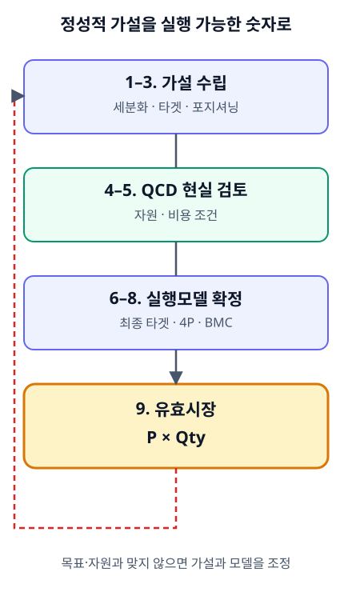

# CH08. 정성에서 정량으로 — 유효시장 추정과 P×Qty

> **발표 핵심 메시지:** 비즈니스모델은 QCD의 현실 검증을 거쳐야 비로소 P×Qty라는 실행 가능한 시장 숫자로 바뀐다.

## 1. 학습목표

이 장을 마치면 정성적 비즈니스모델을 정량 입력으로 전환할 수 있고, 거래유형(B2C·B2B·B2G)별로 Qty(판매수량)의 근거를 다르게 세워 유효시장을 추정할 수 있다.

## 2. 핵심개념

비즈니스모델 캔버스(BMC)는 고객, 가치제안, 채널, 고객관계, 핵심자원, 핵심활동, 파트너십, 비용구조, 수익원을 한눈에 연결해 보는 데 유용한 도구다. 그러나 고객과 가치제안을 포스트잇에 적는 것만으로는 그 사업이 실제로 성립하는지 판단할 수 없다. 실제 사업은 특정 가격으로 특정 수량을 팔았을 때 얼마의 매출이 발생하고, 그 매출을 만들기 위한 비용을 제외한 뒤 얼마가 남는지까지 설명할 수 있어야 한다.

BMC를 추정손익계산서와 연결할 수 있도록 재해석하면, 가격과 수량을 정리해야 매출을 추정할 수 있고, 핵심활동과 비용구조를 통해 사업에 투입되는 비용을 추정할 수 있다. 이렇게 재해석된 BMC는 정성적 아이디어를 정리하는 캔버스에 머무르지 않고, 실행 가능한 사업계획과 재무적 결과를 연결하는 설계도가 된다.

이 정성-정량 전환이 실제로 이루어지는 구체적 절차가 유효시장 추정 9단계이며, 그 마지막 결과물이 가격(P)×판매수량(Qty)이라는 단순한 형태로 표현되는 유효시장 규모다. 다만 이 공식의 형태는 단순해도 P와 Qty를 정하는 방식은 거래관계(B2C·B2B·B2G)마다 다르다.

## 3. 왜 중요한가

정성-정량 전환에서 가장 중요한 전환점은 투입비용 검토 단계다. 그 이전 단계들은 상대적으로 정성적인 컨셉과 시나리오를 만드는 구간이고, 이후는 정량적 검토의 비중이 커지는 구간이다. 비용을 계산한 결과가 감당하기 어렵다면, 앞서 선택한 고객, 상품 스펙, 가격, 채널을 다시 바꾸어야 한다. 즉 숫자는 마지막에 결과로만 적히는 것이 아니라, 앞 단계에서 세운 전략을 다시 수정시키는 피드백 역할을 한다.

이 원칙이 중요한 이유는, 정성적 스토리가 아무리 매력적이어도 P×Qty로 표현되는 유효시장이 사업목표나 자원조건과 맞지 않으면 그 비즈니스모델은 그대로 실행할 수 없기 때문이다. 유효시장 추정은 전체 시장의 일정 비율을 임의로 떼어오는 작업이 아니라, 검증된 고객·가격·채널·자원 조건이 반영된 결과로 시장을 숫자로 표현하는 작업이다.

## 4. Framework / Logic

유효시장 추정은 9단계의 반복 검증 과정으로 이루어진다. 9단계의 목적은 체크리스트를 모두 채우는 데 있지 않다. 아이디어와 시장가설을 세운 뒤 자원과 비용이라는 현실의 필터를 통과시키고, 다시 고객과 가격, 비즈니스모델을 수정하여 마지막에 유효시장이라는 숫자로 표현하는 데 목적이 있다.

**1~3단계: 가설을 세운다.** 아이디어와 환경분석에서 출발해 시장 전체를 세분시장으로 나누고 타겟팅할 세분시장을 선택한다. 이어서 그 타겟 고객을 향한 포지셔닝을 정하고, 이를 구현할 유통과 가격에 대한 가설을 세운다. 이 단계의 결과물은 아직 확정된 사업모델이 아니라 검증 대상이 되는 가설이다.

**4~5단계: QCD로 현실을 확인한다.** 4단계(가용자원 검토)와 5단계(투입비용 검토)로 구성되며, 1~3단계에서 세운 가설이 실제 자원·비용 조건에 비추어 실행 가능한지를 확인하는 구간이다. 이 검토 결과에 따라 가설이나 이후 단계의 비즈니스모델이 다시 조정될 수 있다.

**6~8단계: 실행 가능한 모델로 좁힌다.** QCD 검토 결과를 반영해 최종 타겟팅을 확정하고, 최종 포지셔닝과 4P(제품·가격·유통·프로모션)를 정한 뒤, 이를 바탕으로 최종 BMC를 결정한다. 이 단계의 결과물은 가설이 아니라 실행 가능성이 검증된 사업모델이다.

**9단계: 마지막으로 시장을 숫자로 표현한다.** 확정된 비즈니스모델을 바탕으로 유효시장 규모를 추정한다. 이 숫자는 전체 시장의 일정 비율이 아니라, 1~8단계를 거쳐 검증된 고객·가격·채널·자원 조건이 반영된 결과다. 9단계에서 도출된 규모가 사업목표에 미치지 못하거나 자원조건과 맞지 않으면, 다시 앞 단계로 돌아가 가설과 모델을 재조정한다.

9단계 각 단계는 순서대로 한 번 지나가는 선형 절차가 아니라, 뒤 단계의 결과가 앞 단계로 되돌아가 다시 검토되는 반복적 구조를 가진다.

## 5. 적용 절차

9단계의 마지막 결과인 유효시장 규모는 가격(P)×판매수량(Qty)으로 표현된다. 형태는 동일하지만, 거래유형에 따라 Qty를 산출하는 근거와 방법이 다르다.

**B2C.** 개인 소비자가 구매자이기 때문에 "얼마에 몇 명이 얼마나 자주 구매할 것인가"가 Qty를 설명하는 핵심 논리가 된다. 제품가격과 타깃고객 수, 연간 소비량을 결합해 유효시장 규모를 계산한다.

**B2B.** 가격과 수량이 서로 독립적이지 않고 발주규모와 생산방식에 따라 동시에 움직인다. 주문량에 따라 단가가 달라지고, 대량발주를 통해 고정비를 낮춰야 목표 마진을 확보할 수 있는 구조가 흔하다. 유효시장 규모도 소비자 수를 직접 곱하는 방식보다, 전방산업의 생산실적을 활용하는 Top-down 방식이 사용될 수 있다.

**B2G.** 구매주체가 공공기관이고, 조달 규모가 정부예산과 법적 의무에 영향을 받는다. 장비가격에 잠재 설치대상 수를 곱한 값이 계산되더라도, 실제 공공시장에서 집행 가능한 예산 범위를 넘을 수는 없다. B2G의 Qty는 단순한 기관 수가 아니라, 법령상 설치·관리 의무 여부, 예산항목과 규모, 직접영업과 파트너 채널 중 어떤 접근방식을 쓰는지에 따라 달라진다. 공공시장에서는 제도와 예산이 시장규모를 규정하는 추가 제약조건이 된다.

이처럼 유효시장 추정에서 중요한 것은 하나의 공식을 모든 사업에 일괄 적용하는 것이 아니라, 누가 구매하고 어떤 데이터가 수요를 설명하는지 먼저 판단하는 것이다.

## 6. Pricing 또는 Harness 적용

이 장에서 다룬 P×Qty 논리는 이후 이 교재의 Pricing Harness에서 다루는 손익분기(BEP) 계산의 직접적인 개념적 토대가 된다. 가격(P)과 판매수량(Qty)을 근거를 갖고 산출할 수 있어야 매출을 추정할 수 있고, 그 매출 추정이 있어야 비용구조와 맞물려 손익분기를 계산할 수 있기 때문이다. BEP 계산의 구체적 방법은 후속 장에서 다룬다.

## 7. 실무 체크포인트

- 비즈니스모델을 BMC로 정리했다면, 그 각 요소를 특정 가격×수량의 매출과 그에 대응하는 비용으로 설명할 수 있는지 점검한다.
- 투입비용 검토 결과가 감당하기 어렵다면, 비용을 그대로 받아들이지 말고 고객·상품 스펙·가격·채널 등 앞 단계의 선택으로 돌아가 재조정한다.
- 유효시장 규모를 9단계 전체를 거치지 않고 전체 시장의 임의 비율로 추정하고 있지는 않은지 점검한다.
- Qty의 근거를 세우기 전에 거래유형(B2C/B2B/B2G)부터 명확히 하고, 그에 맞는 데이터(고객 수·소비빈도, 발주규모·생산실적, 예산·법적 의무)를 사용한다.
- 9단계에서 도출한 유효시장 규모가 사업목표나 자원조건에 미치지 못하면, 마지막 단계에서 멈추지 않고 앞 단계로 돌아가 가설과 모델을 다시 조정한다.

## 8. 핵심정리

비즈니스모델은 정성적 컨셉에 머물러서는 안 되며, 특정 가격×수량이 만드는 매출과 비용으로 설명될 수 있어야 한다. 이 전환의 전환점은 투입비용 검토이며, 숫자는 앞 단계의 전략을 되돌아보게 만드는 피드백 역할을 한다. 이 전환은 유효시장 추정 9단계(가설 수립 → QCD 현실 검토 → 최종 모델 확정 → 유효시장 규모 추정)라는 반복 검증 절차를 통해 이루어지며, 그 최종 결과는 P×Qty로 표현된다. P×Qty의 형태는 동일해도 Qty의 근거는 B2C(고객 수×소비빈도), B2B(발주규모·생산실적), B2G(예산·법적 의무)에 따라 다르게 세워야 한다.

## 9. 실무 질문

- 우리 사업의 유효시장 규모는 9단계 절차를 거쳐 나온 숫자인가, 아니면 전체 시장의 임의 비율인가?
- 투입비용을 검토한 결과가 감당하기 어렵다면, 어떤 앞 단계(고객·상품·가격·채널)부터 다시 조정할 것인가?
- 우리 거래유형은 B2C·B2B·B2G 중 무엇이며, 그에 맞는 Qty 근거(고객 수와 소비빈도, 발주규모와 생산실적, 예산과 법적 의무 중 무엇)를 실제로 확보하고 있는가?

## Source Map

- MN: MN07
- KM: KM058, KM059, KM062
