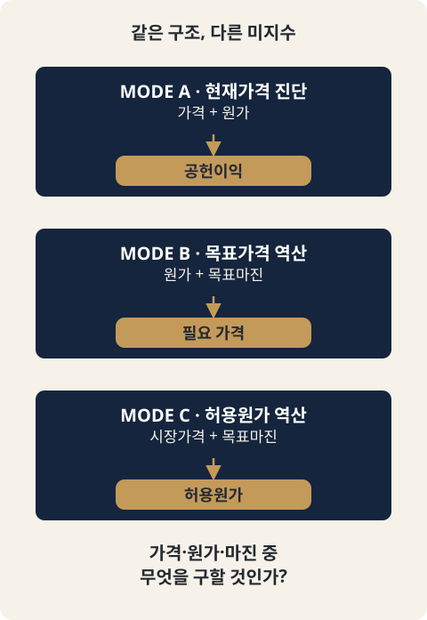

# CH12. MODE C — 허용원가 역산

> **발표 핵심 메시지:** 시장가격이 정해져 있다면 목표마진을 지키는 최대 허용원가를 역산하고 실제원가와의 격차(`direct_cost_gap`)를 확인해야 한다.

## 1. 학습목표

시장가격이 고정된 상황에서 목표 경제성(Contribution Margin Rate)을 지키기 위한 최대 허용원가(Allowable Direct Cost)를 계산할 수 있다.

## 2. 핵심개념

MODE C가 답하는 질문은 하나다.

> "시장가격과 목표 Contribution Margin Rate가 주어졌을 때, 허용 가능한 최대 product/service direct cost는 얼마인가?"

이것은 **target costing(목표원가)** 방식의 계산이다. 제품을 먼저 만들고 나서 "이 가격에 팔 수 있는가"를 사후에 확인하는 cost-plus 방식과 반대로, 시장이 받아들일 가격과 사업이 필요로 하는 마진에서 출발해 제품 설계가 지켜야 할 원가 상한선을 역산한다.

MODE C는 가격을 계산하지 않는다. 판매가격은 시장, 경쟁사 가격, 또는 클라이언트의 기존 가격 포지셔닝에 의해 외생적으로 주어지며, MODE C는 이를 재계산하거나 제안하지 않는다. 오직 "그 가격과 그 마진 목표가 주어졌을 때, 원가에 남은 여유는 얼마인가"만을 계산한다.

## 3. 왜 중요한가

컨설팅 현장에서 클라이언트가 백지에서 가격을 정하는 경우는 드물다. 오히려 시장이 이미 가격을 알려준다 — 경쟁사 가격, 기존 가격 포지셔닝, 고객이 받아들이기 어려운 가격 저항선 등이다. MODE A는 그 가격이 현재 얼마를 벌고 있는지 진단하고, MODE B는 기존 원가구조와 수익성 목표를 유지한 채 필요한 가격이 얼마인지 계산한다. MODE C는 이 둘 중 어느 쪽도 실제 제약조건이 아닐 때 등장한다: "가격은 고정, 마진 목표도 고정. 그렇다면 이 제품은 실제로 원가를 얼마까지 쓸 수 있는가?"

MODE B가 제시한 필요 가격이 시장에서 받아들여지지 않을 때, 또는 신제품·신규 소싱 결정 전에 "이 가격대에서 원가를 얼마까지 쓸 수 있는가"를 먼저 확정하고 싶을 때 MODE C를 사용한다. 반대로 목표 CM Rate 자체가 근거 없이 정해진 경우에는 사용하지 않는다 — 목표율의 타당성은 컨설턴트의 판단 영역이며 MODE C는 이를 검증하지 않는다.

## 4. Framework / Logic

MODE A/B/C는 모두 하나의 Contribution Margin 항등식을 서로 다른 미지수에 대해 푸는 구조다.

```
MODE A: price(given) + cost(given) -> CM (진단)
MODE B: cost(given) + target CM     -> price (미지수)
MODE C: price(given, market) + target CM -> allowable direct cost (미지수)
```

공통 항등식은 `CM = N − ADC − F − bN − aG` 이다. 여기서 `CM/N = t`로 두고 `ADC`에 대해 풀면 다음과 같다.

```
ADC = N(1 − t − b) − aG − F
    = N[1 − t − b − a(1+v)] − F
```

기호는 다음과 같다.

| 기호 | 의미 |
|---|---|
| N | market_net_sales_ex_vat — 시장가격, VAT 제외 |
| G | market_gross_payment_incl_vat — 고객이 실제 지불하는 금액 |
| t | 목표 Contribution Margin Rate |
| b | rate_of_net_sales 기준 variable_selling_delivery 항목 비율의 합 |
| a | rate_of_gross_payment 기준 variable_selling_delivery 항목 비율의 합 |
| F | 금액으로 입력된 variable_selling_delivery 항목의 합 |
| v | VAT 세율 |
| ADC | allowable_direct_cost — MODE C가 구하려는 값 |

F, b, a는 MODE B의 비용 집계와 동일한 항목이지만, `product_service_direct_cost`는 의도적으로 제외된다. MODE B는 이미 알려진 총원가에서 가격을 구하므로 direct cost가 입력에 포함되지만, MODE C는 direct cost 자체를 구하는 것이 목적이므로 입력에 넣을 수 없다.

MODE B의 `N = C/D`(나눗셈)와 달리 MODE C의 `ADC = N·D − F`(곱셈)는 D가 0이든 음수든 항상 계산 가능하다는 점이 구조적으로 다르다. 이 때문에 MODE B에 있는 "분모 ≤ 0" ERROR 케이스가 MODE C에는 없다 — 대신 결과 자체가 음수로 나올 수 있으며, 이는 계산 실패가 아니라 "현재 조건으로는 목표를 달성할 방법이 없다"는 확정적 진단으로 다뤄진다(7절 참고).



## 5. 적용 절차

1. 대상 price component별로 `target_market_price`(시장에서 주어진 실거래가, 할인 반영된 effective price)를 확인한다. 이는 `actual_price`(현재 실제 판매가)와는 별개의 값이며, MODE C는 `actual_price`를 전혀 읽지 않는다.
2. `price_includes_vat`와 `tax.vat_rate`로 N(VAT 제외 순매출)과 G(VAT 포함 총지불액)를 산출한다.
3. `targets.target_contribution_margin_rate`(t)를 확인한다. 0 이상 1 미만이어야 유효하다.
4. `costs.items[]` 중 `cost_category = variable_selling_delivery` 항목만 걸러 F(금액), b(순매출 기준 비율), a(총지불액 기준 비율)를 집계한다. `product_service_direct_cost` 항목은 이 집계에 포함하지 않는다.
5. `ADC = N(1 − t − b) − aG − F`를 계산한다.
6. 필요 시 `product_service_direct_cost` 항목을 별도로 합산해 `actual_direct_cost`를 구하고, `direct_cost_gap = ADC − actual_direct_cost`로 현재 원가와 허용원가의 차이를 확인한다.
7. `expected_contribution_margin = N − ADC − F − bN − aG`와 `expected_contribution_margin_rate = expected_contribution_margin / N`으로 자체 검산한다. ADC가 OK 상태면 이 비율은 정확히 t와 같아야 한다.

## 6. Pricing 또는 Harness 적용

Harness 구현(`core/engine/modes/mode_c.py`의 `run_mode_c` / `compute_component`)은 위 절차를 그대로 코드화한다. 핵심 설계 원칙은 다음과 같다.

- **VAT 의존성은 metric별로 판단한다.** N은 `price_includes_vat=true`일 때만 v가 필요하고, G는 `price_includes_vat=false`일 때만 v가 필요하다. ADC는 N을 항상 필요로 하지만, G는 a>0일 때만 필요하다 — 즉 a=0이면 v를 몰라도 ADC를 OK로 계산할 수 있다.
- **음수 ADC는 ERROR가 아니라 OK다.** ADC 계산은 나눗셈이 아닌 곱셈이므로 N, t, b, a, v, F가 모두 알려져 있으면 항상 계산 가능한 하나의 실수 값이 나온다. 음수 값은 "이 시장가격·수수료 구조·목표 마진으로는 direct cost를 0으로 낮춰도 목표에 도달할 수 없다"는 확정적 진단이며, 0으로 clamp하지 않고 그대로 보존한 뒤 `NEGATIVE_ALLOWABLE_COST`라는 non-blocking 경고를 붙인다.
- **allowable_direct_cost는 actual_direct_cost를 전혀 모른다(Dependency Isolation).** ADC 공식은 `product_service_direct_cost` 항목을 한 번도 읽지 않는다. 따라서 실제 원가 데이터가 없거나 shared 항목이라 배부가 안 되는 상황이라도 ADC는 영향을 받지 않는다. 반대로 F/b/a 쪽(variable_selling_delivery)의 shared 항목이 미해결이면 ADC 자체가 UNKNOWN으로 전파된다.
- **항목이 아예 없음과 항목은 있는데 값이 null인 것은 다른 상태다.** 해당 종류의 비용 항목이 하나도 없으면 그 합계는 확정된 0(OK)이고, 항목이 존재하는데 amount/rate가 미입력이면 UNKNOWN이다.
- **shared 비용 배부 규칙은 MODE A/B와 동일한 원칙을 그대로 따른다.** `blended_only`는 제외, `by_component_revenue`/`fixed_share`/미지정은 UNKNOWN, `direct`는 shared와 의미적으로 모순되므로 ERROR다.

## 7. 실무 체크포인트

- `target_market_price`는 할인이 이미 반영된 실거래가(effective price)이지 정가(list price)가 아니다. `discount_rate`는 MODE C에서 읽지 않는다.
- `actual_price`(MODE A의 현재 판매가)와 `target_market_price`(MODE C의 시장가격)는 서로 다른 필드이며 같은 컴포넌트 안에서 다른 값을 가질 수 있다 — "지금은 90,000에 팔고 있지만 시장은 100,000으로 움직였다" 같은 상황을 표현하기 위함이다.
- ADC가 음수로 나왔다면 "계산이 잘못됐다"가 아니라 "이 조건에서는 목표 달성이 불가능하다"는 신호다. 목표율 재검토, 채널·PG 수수료 재협상, 가격대 자체의 재검토 중 하나를 선택해야 하며, MODE C는 그 선택을 대신하지 않는다.
- `direct_cost_gap`(ADC − actual_direct_cost)이 음수면 현재 원가가 이미 목표 마진이 허용하는 한도를 넘어선 것이다.
- UNKNOWN은 "지금은 답할 수 없다"는 뜻이고 ERROR/음수 ADC는 "이 조건으로는 안 된다"는 뜻이다. 두 신호를 혼동하지 않는다.

## 8. 핵심정리

MODE C는 시장가격을 외생 변수로 두고, 목표 Contribution Margin Rate를 지키기 위한 최대 허용원가를 역산하는 target costing 도구다. `ADC = N[1−t−b−a(1+v)] − F` 공식은 MODE B와 동일한 항등식을 반대 방향으로 푼 것이며, 나눗셈이 아닌 곱셈 구조이기 때문에 음수 결과도 유효한(다만 불리한) 계산 결과로 다뤄진다. 허용원가는 실제원가 데이터와 완전히 독립적으로 계산되며, 둘은 오직 `direct_cost_gap`을 통해서만 마지막에 비교된다.

## 9. 실무 질문

- 이 제품의 시장가격은 실제로 고정되어 있는가, 아니면 MODE B가 제시한 가격을 재검토할 여지가 있는가?
- 목표 Contribution Margin Rate는 어떤 근거로 정해졌는가? 그 근거가 없다면 MODE C 사용 전에 먼저 확인해야 한다.
- ADC가 작은 양수이거나 음수로 나온다면, 소싱 단가 인하·수수료 재협상·가격대 재검토 중 어느 것이 가장 현실적인 선택지인가?
- 현재 실제 원가(actual_direct_cost)는 이번에 계산된 허용원가 안에 들어와 있는가, 아니면 이미 초과했는가?

## Source Map

- MN: MN06 (concept)
- KM: KM054
- Harness: core/engine/modes/mode_c.py (run_mode_c), docs/features/mode_c_allowable_cost/{SPEC,METHOD,CASE}.md

## Gap Note

"Allowable Cost의 범용 정의"는 Master Note에서도 확정되어 있지 않다. Harness의 METHOD.md는 Reference가 MODE C의 개념적 근거(고객가치 기반 가격, 원가는 가격의 현실적 제약조건, target costing의 방향성)는 뒷받침하지만, `ADC = N[1−t−b−a(1+v)] − F`라는 구체적 대수식이나 VAT·수수료를 이 방식으로 결합하는 방법 자체는 정의하지 않는다고 명시한다. 이 공식과 UNKNOWN/ERROR 판정 규칙은 Pricing Harness의 자체 Internal Specification(Category B)이며, "Master Note 원문이 확정한 공식"으로 제시되어서는 안 된다.
