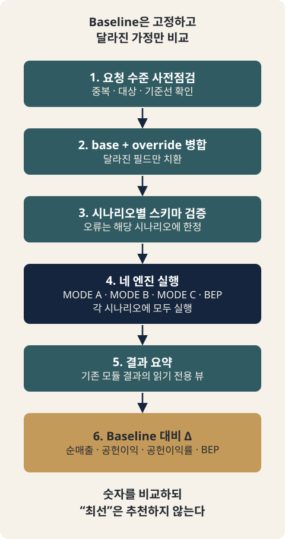

# CH14. Scenario Compare — 시나리오 비교

> **발표 핵심 메시지:** 시나리오 비교는 정답을 추천하는 도구가 아니라, 같은 기준선에서 가정 하나의 변화가 숫자를 어떻게 바꾸는지 보여주는 도구다.

## 1. 학습목표

고객·채널·비용·가격 변화가 경제성에 미치는 영향을 여러 시나리오로 비교하고 baseline 대비 delta를 해석할 수 있다.

## 2. 핵심개념

Scenario Compare는 "가격·원가·목표 수익성·고정비 조건을 다르게 가정했을 때, 각 시나리오의 경제성이 어떻게 달라지는가?"라는 질문에 답하기 위한 도구다. 여기서 반드시 짚어야 할 점은, Scenario Compare가 새로운 계산 엔진이 아니라는 것이다. MODE A(실제 가격 진단), MODE B(필요 판매가 역산), MODE C(허용 가능 원가 산출), BEP(손익분기점)는 이미 각자 정해진 공식으로 계산을 수행하는 네 개의 독립된 엔진이다. Scenario Compare는 이 네 엔진에 새로운 공식을 추가하지 않는다. 대신 하나의 기준(baseline) 시나리오와 여러 개의 변형(variant) 시나리오를 만들어, 같은 네 엔진을 시나리오 개수만큼 반복 실행하고 그 결과를 나란히 정리해 보여주는 오케스트레이션(orchestration) 계층이다.

Scenario Compare가 결과에 내놓는 모든 숫자는 반드시 `run_mode_a` / `run_mode_b` / `run_mode_c` / `run_bep` 중 정확히 하나의 호출로 거슬러 올라갈 수 있다. Scenario Compare 자신은 가격 공식도, 공헌이익 정의도, 손익분기 공식도, 부가세 정규화 방식도, 비용 배분 규칙도 새로 정의하지 않는다.

## 3. 왜 중요한가

실무에서 가격 의사결정은 "하나의 가정에 대한 하나의 답"만으로 이루어지지 않는다. 가격을 10% 올리면 어떻게 되는가? 특정 공급처 원가를 낮추면 어떻게 되는가? 시장이 받아들일 수 있는 가격이 예상보다 낮다면 어떻게 되는가? 이런 질문에 답하려면 기존에는 매번 Client Input을 손으로 조금씩 바꿔가며 각 모드를 다시 돌리고, 결과 차이를 사람이 눈으로 비교해야 했다. Scenario Compare는 이 비교 작업을 반복 가능하고 신뢰할 수 있는 1급 기능으로 만든 것이다 — 새로운 계산이 아니라, 기존 계산을 통제된 차이를 두고 여러 번 실행하고 결과를 나란히 정렬하는 체계적인 방법이다.

## 4. Framework / Logic

Scenario Compare는 "base + override" 설계를 채택한다(SPEC.md §2 Design B). 각 시나리오는 독립된 전체 문서(스냅샷)로 존재하지 않는다. 대신 하나의 `base_input`(정상적인 Client Input 한 건)을 두고, 각 시나리오는 그 base 대비 어떤 필드를 바꾸는지를 짧고 명시적인 override 목록으로만 표현한다. 이렇게 하면 시나리오 간 실제로 무엇이 달라졌는지가 override 목록 자체에서 바로 드러나고, override되지 않은 모든 필드는 구조적으로 동일함이 보장된다.

override는 배열 인덱스가 아니라 스키마 자체의 안정적인 식별자(`component_id`, `item_id`)로 주소를 지정하며, 대상 종류별로 그룹화된다: `components`(가격구성요소별 실제가/목표시장가/VAT포함여부/할인율), `cost_items`(비용항목별 금액/비율), `targets`(목표 공헌이익률), `tax`(VAT율), `fx`(환율). 이 목록은 닫힌 allowlist이며, `cost_category`, `basis`, `applies_to_component`, `allocation_rule` 같은 비용 항목의 "의미"를 바꾸는 필드나 `component_id`/`item_id` 자체는 override 대상이 아니다.

Scenario Compare는 6단계 파이프라인으로 실행된다(SPEC.md §7, `scenario_compare.py` 상단 주석과 정확히 일치):

- STEP 1 — 요청 수준 사전점검(preflight): 시나리오 2개 이상, `scenario_id` 중복 없음, `baseline_scenario_id` 명시 및 존재 확인, `base_input` 내 `component_id`/`item_id` 중복 없음, override가 가리키는 대상이 실제로 존재하는지, 같은 시나리오 안에서 같은 대상을 두 번 override하지 않는지 등을 확인한다. 여기서 실패하면 요청 전체가 ERROR가 되며 어떤 모드 엔진도 실행되지 않는다.
- STEP 2 — base + override 병합: `base_input`을 깊은 복사(deep copy)한 뒤 override를 순수한 필드 치환으로 적용한다. 생략된 필드는 base 값을 그대로 유지하고, 명시적으로 `null`을 지정한 필드는 UNKNOWN이 된다.
- STEP 3 — 병합된 client_input의 스키마 검증: 이 검증을 통과하지 못하면 해당 시나리오만 ERROR가 되고 모드 실행 없이 종료되지만, 다른 시나리오들은 각자 독립적으로 계속 진행된다.
- STEP 4 — `run_mode_a`/`run_mode_b`/`run_mode_c`/`run_bep` 실행(모든 시나리오에 대해 네 모드 전부 실행 — 시나리오 목적에 맞는 일부만 실행하지 않는다).
- STEP 5 — 네 모듈 결과를 읽기 전용으로 요약(summary) 뷰 구성.
- STEP 6 — baseline 대비 delta 계산.

전체 시나리오 상태는 ERROR > INCOMPLETE > OK 3단계 규칙으로 결정되며, 네 모듈 중 하나라도 ERROR면 시나리오 전체가 ERROR, ERROR 없이 하나라도 INCOMPLETE면 시나리오는 INCOMPLETE, 모두 OK(또는 아직 구현되지 않은 NOT_IMPLEMENTED)면 OK다.

## 5. 적용 절차

1. **Baseline 정의**: 비교의 기준이 될 현재 상태(현재 가격, 현재 원가, 현재 목표수익률 등)를 하나의 완전한 `base_input`으로 정의한다.
2. **Baseline scenario 지정**: 시나리오 목록 중 하나를 `baseline_scenario_id`로 명시적으로 지정한다. 목록의 첫 번째 시나리오가 자동으로 baseline이 되는 규칙은 없다.
3. **변형 시나리오 설계**: 검토하고 싶은 가정 변화(가격 인상/인하, 특정 원가 항목 변화, 채널·목표수익률 변화, 고정비 변화 등)를 각각 하나의 시나리오로 만들고, 그 시나리오가 base 대비 실제로 바꾸는 필드만 override로 적는다.
4. **최소 2개 이상 시나리오 확보**: 비교가 성립하려면 시나리오가 최소 2개 필요하다.
5. **실행**: `run_scenario_compare(request)`를 호출하면 6단계 파이프라인이 각 시나리오에 대해 독립적으로 실행된다.
6. **결과 해석**: 각 시나리오의 절대 수치(mode_a/mode_b/mode_c/bep 결과)와, baseline 대비 delta(순매출·공헌이익·공헌이익률·손익분기수량 차이)를 함께 읽는다.
7. **상태 확인**: 시나리오별 `scenario_status`와 delta의 상태(OK/UNKNOWN/NOT_APPLICABLE/ERROR)를 함께 확인해, 숫자만이 아니라 그 숫자가 신뢰할 수 있는 상태인지도 판단한다.

## 6. Pricing 또는 Harness 적용

Scenario Compare는 다음 네 가지 delta 지표만 v0.1 최소 세트로 제공한다(SPEC.md §14):

- `net_sales_ex_vat_delta` — MODE A의 `actual_price_ex_vat` 기준 차이 (VAT 표시 방식이 달라도 왜곡되지 않는 값)
- `contribution_margin_delta` — MODE A의 `contribution_margin` 기준 차이
- `contribution_margin_rate_delta` — MODE A의 `contribution_margin_rate` 기준 차이
- `break_even_quantity_delta` — BEP의 `break_even_quantity_exact` 기준 차이

각 delta는 정확히 하나의 모드에서 나온 하나의 필드만 읽으며, 이름이 비슷한 다른 모드의 지표(예: MODE B/C의 유사 지표)로 대체되지 않는다. 두 값 중 하나라도 ERROR면 delta는 ERROR, 하나라도 UNKNOWN이면 UNKNOWN, 하나라도 NOT_APPLICABLE이면 NOT_APPLICABLE, 둘 다 숫자로 확정된 OK일 때만 실제 뺄셈이 수행되어 OK가 된다. baseline 자신의 self-delta도 예외가 아니다 — 같은 값끼리의 비교라 해서 무조건 0/OK가 되는 것이 아니라, 원천 지표 자체의 상태를 그대로 따른다(원천이 UNKNOWN이면 self-delta도 UNKNOWN).

Scenario Compare는 v0.1에서 시나리오에 순위를 매기거나 "최선의 시나리오"를 추천하지 않는다(SPEC.md §12). 이는 구현이 덜 된 것이 아니라 의도된 범위 제한이다 — 가격 의사결정은 시장 포지셔닝, 고객 가치 인식, 경쟁 역학 등 이 계산 계층이 접근할 수 없는 정보에 의존하기 때문이다. Scenario Compare의 산출물은 어디까지나 "숫자를 나란히 놓고 차이를 보여주는" 서술적 비교(descriptive comparison)다.

## 7. 실무 체크포인트

- baseline을 명시했는가? (첫 번째 시나리오가 자동으로 baseline이 되지 않는다는 점을 팀원들에게도 주지시킨다.)
- 각 시나리오의 override 목록이 실제로 검토하려는 가정 변화만 담고 있는가? (관련 없는 필드가 실수로 함께 바뀌지 않았는지.)
- baseline 시나리오 자체가 유효한가? baseline이 스키마 검증에 실패하면(STEP 3 실패) 다른 시나리오들의 절대 수치는 정상 보존되지만, 모든 delta는 ERROR로 표시된다(`BASELINE_SCENARIO_INVALID_FOR_DELTA` 경고).
- delta 값이 0이라고 해서 "아무것도 안 바뀌었다"고 단정하지 않는다. 특정 지표만 override 대상과 무관해 delta가 0일 수 있고(예: 고정비만 바꿨다면 MODE A/B/C의 delta는 모두 0, BEP만 변화), 동일 시나리오 내에서도 지표별로 delta 상태가 다를 수 있다.
- delta 상태가 UNKNOWN/NOT_APPLICABLE/ERROR인 경우, 이를 숫자 0으로 오독하지 않는다. `value: null`은 계산이 되지 않았다는 뜻이지 변화가 없다는 뜻이 아니다.
- 다중 컴포넌트(둘 이상의 가격구성요소)를 가진 시나리오는 BEP가 구조적으로 `MULTI_COMPONENT_BEP_NOT_SUPPORTED` ERROR를 반환한다 — 이는 Scenario Compare가 우회하거나 숨기지 않는, 기존 BEP 모듈의 알려진 제약이다.

## 8. 핵심정리

Scenario Compare는 MODE A/B/C/BEP 위에 얹힌 오케스트레이션 계층으로, 하나의 baseline 시나리오와 여러 변형 시나리오를 base+override 방식으로 정의해 기존 네 엔진을 반복 실행하고 결과를 나란히 비교한다. 새로운 가격·원가 공식을 만들지 않으며, 모든 출력 숫자는 기존 모드 호출로 추적 가능하다. 4가지 delta 지표(순매출, 공헌이익, 공헌이익률, 손익분기수량)로 baseline 대비 변화를 보여주되, 어느 시나리오가 "더 낫다"는 판단은 하지 않는다.

## 9. 실무 질문

- 우리가 지금 비교하려는 시나리오들의 baseline은 무엇으로 정의해야 하는가 — 현재 가격인가, 아니면 다른 기준점인가?
- 검토 중인 변화(가격, 원가, 채널, 목표수익률, 고정비) 중 어떤 조합이 실제 의사결정에 가장 직접적인 영향을 주는가?
- delta가 0으로 나온 지표와 크게 변한 지표를 함께 놓고 볼 때, 그 조합이 의사결정에 시사하는 바는 무엇인가?
- delta가 UNKNOWN/NOT_APPLICABLE로 나온 항목이 있다면, 그 원인이 되는 입력값 누락이나 구조적 제약은 무엇이며 어떻게 해소할 수 있는가?

## Source Map

- MN: MN07 (concept)
- KM: KM063
- Harness: core/engine/scenario_compare.py (run_scenario_compare), docs/features/scenario_compare/{SPEC,METHOD,CASE}.md
