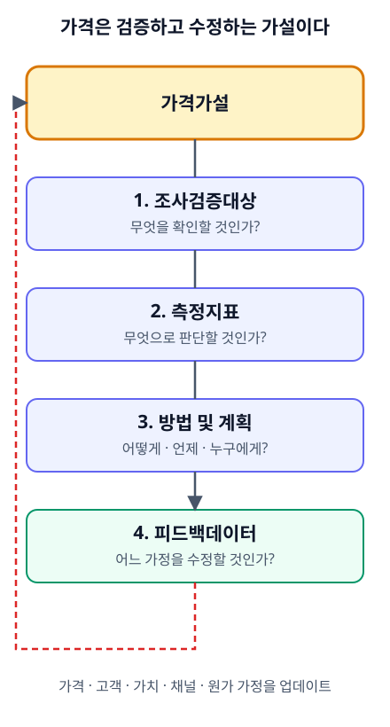

# CH15. 가격가설의 검증과 의사결정

> **발표 핵심 메시지:** 가격은 한 번 계산해 확정하는 숫자가 아니라, 시장 데이터로 계속 검증하고 수정하는 살아 있는 가설이다.

## 1. 학습목표

가격을 확정된 진리가 아니라 검증 대상 가설로 다루고, 검증설계 4요소(조사검증대상·측정지표·방법 및 계획·피드백데이터)로 다음 실험을 설계하며, 가격 검증 과정에서 AI와 사람의 역할 경계를 이해한다.

## 2. 핵심개념

지금까지 이 교재의 앞선 장들은 가격을 계산하는 방법 — 원가구조, Contribution Margin, MODE A/B/C, 세그먼트별 가격, 협상 대응 등 — 을 다루었다. 그러나 어떤 방식으로 계산했든, 그 결과로 나온 가격은 확정된 사실이 아니라 하나의 가설이다. "이 가격이면 목표 마진을 달성하면서도 고객이 지불할 것이다"라는 문장은 계산이 아니라 검증되어야 할 명제다.

실행은 계획을 지키는 단계가 아니라 계획이 현실과 어디에서 어긋나는지를 찾는 검증 단계다. 가격을 정하고 시장에 내놓는 행위도 마찬가지다. 가격을 제시한 뒤에 일어나는 일 — 견적이 받아들여지는지, 협상에서 얼마나 밀리는지, 재구매가 이어지는지 — 은 가격가설이 맞았는지를 알려주는 데이터이며, 이 데이터를 읽고 다음 가설로 넘어가는 과정이 이 장의 주제다.

사업계획은 완성된 사실의 집합이 아니라 서로 연결된 가설의 구조다. 어떤 고객이 이 가격을 지불할 것이라는 가설, 이 가격이 특정 채널·세그먼트에서 통할 것이라는 가설은 다른 구성요소(고객, 가치, 채널, 원가)에 대한 가설과 연결되어 있다. 가격 하나만 따로 떼어 "맞다/틀리다"를 판단할 수 없는 경우가 많은 이유다.

가설을 검증 가능한 실험으로 바꾸려면 네 가지 항목을 순서대로 연결해야 한다.

- **조사검증대상**: 지금 확인하고 싶은 가격가설이 정확히 무엇인가.
- **측정지표**: 그 가설이 맞았는지를 무엇으로 판단할 것인가.
- **방법 및 계획**: 어떤 방법으로, 언제, 누구를 대상으로 확인할 것인가.
- **피드백데이터**: 확인 결과를 어느 가격 구성요소를 수정하는 근거로 되돌릴 것인가.

이 네 항목이 연결되지 않으면 "시장 반응을 본다"는 말은 막연한 관찰에 머문다. 연결되면 가격 실행은 다음 결정을 더 정확하게 만드는 실험이 된다.

## 3. 왜 중요한가

가격 계산이 아무리 정교해도, 그 결과가 현실에서 검증되지 않으면 사업지식으로 이어지지 않는다. 실행과 학습이 연결되지 않으면 견적을 보내고 협상을 하는 활동량은 늘어도, 다음 가격 결정이 더 나아지지는 않는다.

또한 좋은 사업계획서의 힘은 문장의 매끄러움이 아니라 "왜 이 가격으로 결정했는가"를 설명하는 근거에 있다. 고객 인터뷰, 경쟁 가격 조사, 실제 견적 결과, 실패한 협상 기록 같은 백데이터가 판단의 이력을 만든다. 이 장에서 다루는 검증설계는 그 백데이터를 의도적으로 쌓는 절차다.

마지막으로, 검증은 완성품이나 대규모 가격 변경을 전제하지 않는다. 감당 가능한 위험 안에서 작고 반복 가능한 검증을 설계할 수 있다는 원칙은 가격에도 그대로 적용된다. 전체 고객군의 가격을 한 번에 바꾸기 전에, 한 세그먼트·한 채널·한 견적 건에서 가설을 먼저 확인할 수 있다.

## 4. Framework / Logic

이 장의 논리는 세 층으로 이어진다.

**1층 — 가격은 가설이다.** 실행은 계획을 검증하는 단계이며, 가격도 그 계획의 한 구성요소로서 검증 대상이다. 가격을 확정된 진리처럼 다루면, 시장 반응이 가설을 반증해도 그것을 "학습 신호"가 아니라 "예외적인 불운"으로 처리하게 된다.

**2층 — 검증은 네 요소로 설계한다.** 조사검증대상·측정지표·방법 및 계획·피드백데이터라는 네 항목은 막연한 "가격 반응을 지켜보자"를 의사결정 가능한 실험으로 바꾼다. 다만 이 네 항목을 연결하는 방법을 원자료가 제시하더라도, "몇 건이면 충분하다", "몇 퍼센트 성사율이면 통과다" 같은 보편적 임계값은 제시되어 있지 않다. 증거의 충분성은 검증하려는 의사결정의 크기와 실패했을 때의 위험을 함께 보며 그때그때 정해야 한다.

**3층 — 검증 결과는 피보팅으로 이어질 수 있다.** 피보팅은 새로운 아이디어가 떠올랐기 때문이 아니라 데이터가 기존 가설을 흔들었기 때문에 일어난다. 가격 검증에서도 마찬가지다. 데이터가 가격 가설을 흔들었다면, 그 판단은 가격 자체만이 아니라 고객·가치·채널 가정을 다룬 앞선 장으로 돌아가는 근거가 된다.

이 세 층을 관통하는 것은 "실험의 크기는 사업의 크기와 같을 필요가 없다"는 원칙이다. 가격 전체를 바꾸기 전에 한 컴포넌트, 한 세그먼트, 한 채널에서 먼저 확인할 수 있다.

## 5. 적용 절차

1. **가격가설을 문장으로 적는다.** "이 세그먼트는 이 가격을 지불할 것이다", "이 채널에서는 할인 없이도 거래가 성사될 것이다"처럼, 참/거짓을 구분할 수 있는 형태로 적는다.
2. **조사검증대상을 정한다.** 위 가설 중 지금 가장 불확실하거나, 틀렸을 때 영향이 큰 부분이 무엇인지 좁힌다.
3. **측정지표를 정한다.** 가격 수용 여부, 협상에서의 할인폭, 견적 성사율, 재구매율 등 원자료에 근거해 다룰 수 있는 지표 중에서 가설과 직접 연결되는 것을 고른다.
4. **방법 및 계획을 세운다.** 인터뷰, VOC, 실제 견적 발송, 소규모 채널 테스트 등 완성된 제품·전면적 가격 개편 없이도 확인할 수 있는 방법을 우선 고려한다. 감당 가능한 위험 범위 안에서 표본과 기간을 정한다.
5. **실행하고 결과를 기록한다.** 결과는 성공/실패로만 남기지 않고, 어떤 가정이 맞았고 어떤 가정이 어긋났는지 구체적으로 기록한다.
6. **피드백데이터로 연결한다.** 검증 결과가 가격 가정을 흔들었다면, 그것이 원가구조 장인지, 가치기반 가격 장인지, 세그먼트·채널 장인지 판단하여 해당 구성요소를 다시 여는 근거로 삼는다.
7. **AI와 사람의 역할을 구분한다.** 인터뷰 기록 정리, 견적 데이터 요약, 패턴 비교, 실험 시나리오 초안 작성은 AI가 속도를 높일 수 있는 영역이다. 그러나 어떤 위험을 감수할지, 실제 현장 데이터와 AI의 추론이 충돌할 때 무엇을 우선할지는 사업가와 기획자가 최종적으로 판단한다.

## 6. Pricing 또는 Harness 적용

이 장은 솔직히 밝혀야 할 한계가 있다. 현재 Pricing Harness에는 가격 검증(validation)이나 피드백 데이터를 저장·추적하는 별도의 데이터 구조가 없다. 검증 결과를 누적 기록하는 전용 기능, 독립된 Executive Dashboard, 컨설팅 리포트 생성기, 견적서(Quotation) 생성기 모두 아직 구현되어 있지 않다.

Harness가 실제로 제공하는 것은 CH14에서 다룬 Scenario Compare뿐이다. 이 기능은 검증 전용으로 설계되지는 않았지만, "가격가설이 바뀌면 어떻게 되는가"를 비공식적으로 비교하는 데 활용할 수는 있다. 예를 들어 현재 가격을 하나의 시나리오로, 검증하려는 대안 가격을 다른 시나리오로 두고 MODE A/B/C 계산 결과를 나란히 비교하면, "이 가격가설이 맞다면 Contribution Margin이 어떻게 달라지는가"라는 질문에는 답할 수 있다. 다만 이것은 검증 결과를 사전에 시뮬레이션하는 것이지, 실제 시장 반응 데이터를 수집·기록·추적하는 기능이 아니다.

따라서 이 장에서 설계한 검증설계 4요소, 특히 "피드백데이터"를 체계적으로 축적하고 다음 가격 결정에 자동으로 연결하는 작업은 현재로서는 이 교재의 워크시트(CH15-worksheet.md)와 같은 수기 또는 별도 문서 기반 절차로 수행해야 한다. 이 기능적 공백은 향후 Harness 확장 과제로 남아 있으며, 이 교재에서 없는 기능을 있는 것처럼 서술하지 않는다.

## 7. 실무 체크포인트

- 가격을 "이미 계산했으니 끝난 일"로 취급하지 않는다. 계산된 가격은 검증의 시작점이지 종착점이 아니다.
- 검증설계 4요소(조사검증대상·측정지표·방법 및 계획·피드백데이터) 중 하나라도 비어 있으면 실험이 아니라 막연한 관찰이 된다.
- 검증에 필요한 증거의 양은 사업마다, 결정의 크기마다 다르다. 보편적인 "몇 건이면 충분하다"는 기준은 없으므로, 실패했을 때의 위험을 함께 따져 스스로 기준을 정한다.
- MVP나 전면적 가격 개편처럼 되돌리기 어려운 실험보다, 작고 반복 가능하며 감당 가능한 위험 안의 검증을 우선한다.
- 검증 결과가 가격 가정을 흔들었을 때, 그것을 가격 페이지 수정으로만 끝내지 않고 어느 구성요소(원가, 가치, 세그먼트, 채널)의 가정이 함께 바뀌어야 하는지 확인한다.
- AI가 만든 요약·비교·초안은 판단의 재료이지 판단 그 자체가 아니다. 현장 데이터와 AI의 추론이 충돌하면 현장 데이터와 사람의 최종 판단이 우선한다.
- 현재 Harness에는 검증 데이터를 저장하는 기능이 없다는 점을 전제하고, 검증 기록은 별도 문서(워크시트 등)로 관리한다.

## 8. 핵심정리

이 장, 그리고 이 교재 3부 전체가 전하려는 메시지는 하나로 모인다. 가격은 한 번 계산해서 확정하는 숫자가 아니라, 계속 검증하고 필요하면 수정하는 살아 있는 가설이다. 검증설계 4요소는 그 검증을 막연한 관찰이 아니라 다음 결정을 더 정확하게 만드는 절차로 바꾸는 도구이며, AI는 이 절차의 속도를 높이는 보조 레이어일 뿐 최종 판단의 주체가 아니다.

이것으로 이 교재의 15개 장을 모두 마친다. 가격 검증에서 나온 데이터가 가격 자체가 아니라 더 앞선 가정 — 원가구조가 실제로 그 수준인지, 가치기반 가격이 고객에게 실제로 통하는지, 수익모델이 그 채널·세그먼트에 맞는지 — 을 흔드는 경우는 드물지 않다. 그런 신호가 나타났다면, 이 교재를 처음부터 다시 읽으라는 뜻이 아니라, 데이터가 가리키는 구체적인 장 — 원가 관련 장이라면 원가구조를, 가치기반 가격이 흔들렸다면 해당 장을, 수익모델 가정이 흔들렸다면 그 장을 — 을 다시 열어 그 부분만 업데이트하라는 뜻이다. 실행은 계획을 한 번 세우고 끝내는 일이 아니라, 현실이 알려주는 대로 계획의 특정 부분을 다시 여는 과정이며, 가격 역시 그 과정 안에서 계속 검증되는 하나의 구성요소다.

## 9. 실무 질문

- 지금 내가 쓰고 있는 가격은 어떤 가설에 근거하고 있는가? 그 가설을 한 문장으로 적을 수 있는가?
- 그 가설이 틀렸다면, 무엇을 보고 알 수 있는가? 측정지표를 지금 구체적으로 말할 수 있는가?
- 가장 작고 감당 가능한 위험 안에서, 이 가격가설을 확인할 수 있는 방법은 무엇인가?
- 최근 가격과 관련해 예상과 다른 결과(할인 요구, 거절, 이례적으로 쉬운 성사)가 있었다면, 그것은 어느 구성요소(원가·가치·세그먼트·채널)의 가정을 흔드는 신호인가?
- 가격 검증 과정에서 AI에게 맡길 부분과, 반드시 사람이 최종 결정해야 할 부분을 지금 구분할 수 있는가?

## Source Map

- MN: MN08
- KM: KM064, KM065, KM066, KM067, KM068, KM071
