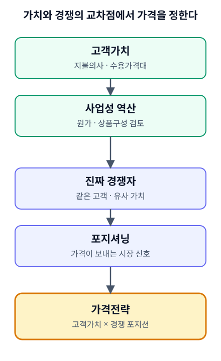

# Diagram Standard (Pricing Strategy Handbook)

Visual language for educational diagrams in the Pricing Strategy Handbook. It is the same standard used by the Business Planning Handbook, so the two handbooks look like one system. Only the file locations and build details below are specific to this repository.

Diagrams are a compressed visual form of what a chapter already says. They never add concepts, steps, numbers, or examples.

## Source-bound rule

- Every box, label, and arrow must trace to text in the public chapter (`ko/chapters/CHxx.md`, `en/chapters/CHxx.md`).
- Forbidden: steps not in the chapter, outside theory, external frameworks, invented numbers or cases, concepts added for visual balance, definite arrows for relationships the chapter leaves ambiguous.
- Draw what each connector claims and nothing more: a solid arrow means "feeds / is followed by", a plain `+` means "combined with", a dashed arrow means "return and revise".
- Before adding or changing a diagram, write down which chapter passage supports each element. A spec per diagram (as in the Business Planning Handbook, `site/diagrams/specs/`) is recommended for new diagrams. The eight diagrams in `assets/images/` do not have specs yet.

## Palette

| Role | Color | Use |
|---|---|---|
| Deep Navy | `#14253D` | core concept / primary node |
| Deep Teal | `#315B62` | supporting concept, ordinary steps |
| Warm Gold | `#C49A5A` | decision, emphasis, key result, key relationship |
| Warm Ivory | `#F6F2EA` | diagram background panel |
| White | `#FFFFFF` | inner panels |
| Charcoal | `#252A30` | main text (and text on gold) |
| Muted | `#6B7280` | secondary text (not used on ivory below 16px) |

Meaning is never carried by color alone: pair it with a label, position, or line style (solid / dashed / `+`).

Conventions used in this handbook's diagrams:

- Gold: the outcome the chapter builds toward (for example Price, Price structure, Business feasibility, the Δ vs baseline) and any decision gate (for example QCD).
- Navy: a separate core category inside a flow (for example the four engines, the three financial lenses, the three modes).
- Teal: ordinary steps and inputs.
- Gold dashed arrow: return and revise (always explained in a legend line).

## SVG rules

- Flat, minimal, generous whitespace, subtly rounded boxes (`rx` 10), simple arrows. No gradients, no decorative illustration, no icon sets, no shadows.
- `viewBox` only, no fixed pixel width. Canonical width is 480 units so the diagram stays legible at 375px. Height follows the content.
- No `<script>`, no `<style>` block, no external resources, no external fonts, no embedded raster images. System font stack only, set on the root `<svg>`.
- Text stays as `<text>` (never converted to paths). Use presentation attributes (`font-size`, `font-weight`, `fill`) rather than CSS classes.
- Semantic `<g id="...">` groups (`headline`, `flow`, `return-loop`, `caption`, `legend`, one group per box); `<title>` and `<desc>` on the root, linked with `aria-labelledby`.
- Always include an explicit Warm Ivory background `<rect>` (inside `<g id="background">`) so the diagram stays readable in Starlight dark mode.
- One arrow per `<path>` or `<line>`. Never put several connectors into one path with a `marker-end`: the arrowhead is drawn only at the end of the last sub-path, so the other connectors lose theirs.
- Text sizes: headline, caption, and box titles 20; box body 17; result chips 18; legends 16; the `+` connector 30. At 375px the SVG scales to about 0.7, so do not go below 16 units.
- Keep at least 4 units of padding between any text and the edge of its box.
- Layouts are vertical so they do not shrink into unreadable horizontal strips on mobile.

## Structure of a diagram

1. Headline: the chapter's key message in one or two centered lines (20, bold). This is the one deliberate difference from the Business Planning diagrams, which rely on the `###` heading above the image; the Pricing chapters use the headline as their key-message line.
2. Boxes in a single column (width 400, or 380 when a return loop runs on the right).
3. Connectors between boxes (arrows, or `+` for combined inputs).
4. Optional caption (closing message) and legend (explains solid and dashed arrows).

## Localization

- Each diagram exists as a pair: `<name>-ko.svg` and `<name>-en.svg`.
- A KO and EN pair shares identical geometry, hierarchy, color meaning, and relationships. Only text differs. If English runs longer, break lines or increase the box height in both versions; do not shrink type.
- Verify parity by removing `<title>`, `<desc>`, and `<text>` from both files and comparing what is left: it must be identical.

## File locations and build

- Canonical source: `assets/images/<name>-ko.svg` and `assets/images/<name>-en.svg`. Names follow `chNN-<topic>-<locale>.svg` (for example `ch03-two-logics-ko.svg`).
- Chapter Markdown references the file by relative path so it also renders on GitHub:

```

```

- `site/scripts/sync-content.mjs` copies `assets/images/` to `site/public/images/` and rewrites the links to include the site base path. The copies are generated and gitignored; never edit them.
- `site/src/styles/custom.css` caps image height to one screen (`max-height: calc(100dvh - 9rem)`) and lets the width follow the aspect ratio.
- Place a diagram right after the chapter has first explained the concept, never as a decorative opener. Give it meaningful alt text that states what the diagram shows.

## Checklist before publishing a diagram

- [ ] Every element traces to chapter text; nothing added.
- [ ] KO and EN pair passes the parity check.
- [ ] No text is within 4 units of its box edge or outside the canvas.
- [ ] Every connector has its own arrowhead where an arrow is intended.
- [ ] `<title>`, `<desc>`, ivory background panel present; no script, style block, external reference, or gradient.
- [ ] No public-safety blocker terms in the file.
- [ ] Looks right at 375px, 768px, and 1440px, and in light and dark mode.

## Out of scope

No Mermaid pipeline. Process diagrams stay hand-built SVG.
